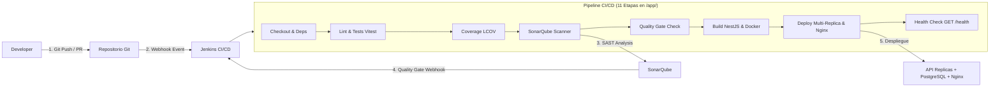

# Riwi Cine Backend (NestJS) — Guia Completa de Integracion CI/CD

Guia paso a paso para configurar la pipeline de integracion y despliegue continuo (CI/CD) de **Riwi Cine Backend**, conectando **GitHub / GitLab**, **Jenkins**, **SonarQube** y **Docker Compose** con balanceo de carga en **Nginx**.

---

## Tabla de Contenidos
1. [Arquitectura del Pipeline CI/CD](#1-arquitectura-del-pipeline-cicd)
2. [Requisitos Previos y Levantamiento del Entorno DevOps](#2-requisitos-previos-y-levantamiento-del-entorno-devops)
3. [Paso 1: Configurar el Proyecto y Token en SonarQube](#3-paso-1-configurar-el-proyecto-y-token-en-sonarqube)
4. [Paso 2: Instalacion de Plugins y Herramientas en Jenkins](#4-paso-2-instalacion-de-plugins-y-herramientas-en-jenkins)
5. [Paso 3: Integrar Jenkins con SonarQube (Credenciales y Servidor)](#5-paso-3-integrar-jenkins-con-sonarqube-credenciales-y-servidor)
6. [Paso 4: Configurar el Webhook de SonarQube hacia Jenkins (Quality Gate)](#6-paso-4-configurar-el-webhook-de-sonarqube-hacia-jenkins-quality-gate)
7. [Paso 5: Conectar el Repositorio Git y Crear el Pipeline en Jenkins](#7-paso-5-conectar-el-repositorio-git-y-crear-el-pipeline-en-jenkins)
8. [Paso 6: Configurar el Webhook del Repositorio hacia Jenkins (Disparo Automatico)](#8-paso-6-configurar-el-webhook-del-repositorio-hacia-jenkins-disparo-automatico)
9. [Paso 7: Ejecucion y Flujo de las 11 Etapas del Pipeline](#9-paso-7-ejecucion-y-flujo-de-las-11-etapas-del-pipeline)
10. [Paso 8: Escalado Dinamico y Verificacion](#10-paso-8-escalado-dinamico-y-verificacion)
11. [Solucion de Problemas Frecuentes (Troubleshooting)](#11-solucion-de-problemas-frecuentes-troubleshooting)

---

## 1. Arquitectura del Pipeline CI/CD

El flujo de integracion y despliegue opera de forma automatizada ante cada evento de codigo:



### Puertos y Servicios Principales
| Servicio | Contenedor | Puerto Host | Descripcion |
| :--- | :--- | :--- | :--- |
| **Jenkins** | `jenkins` | `8080` / `50000` | Servidor CI/CD y orquestador |
| **SonarQube** | `sonarqube` | `9000` | Analisis estatico de codigo (SAST) y metricas |
| **Nginx (Load Balancer)** | `cine-nginx` | `80` | Proxy reverso y balanceador de carga |
| **Backend NestJS (API)** | `api` (escalable) | `3000` (interno) | Instancias replicadas de la aplicacion |
| **PostgreSQL** | `postgres` | `5432` | Base de datos relacional principal |
| **Zabbix Web UI** | `zabbix-web` | `8088` | Monitoreo y metricas en tiempo real |

---

## 2. Requisitos Previos y Levantamiento del Entorno DevOps

### Requisitos del Sistema
- **Docker Engine** 24.0+ y **Docker Compose V2**
- **Git** instalado
- Minimo **4 GB de RAM** disponibles (SonarQube y Jenkins requieren recursos de JVM)
- Configurar el limite de memoria virtual para Elasticsearch de SonarQube (en Linux):
  ```bash
  sudo sysctl -w vm.max_map_count=262144
  # Para persistir entre reinicios:
  echo "vm.max_map_count=262144" | sudo tee -a /etc/sysctl.d/99-sonarqube.conf
  ```

### 1. Clonar el Repositorio y Configurar Variables
```bash
git clone https://github.com/manulzweb/riwi-cine-nest.git
cd riwi-cine-nest

# Crear archivo .env base si aun no existe
cp .env.example .env
```

### 2. Iniciar los Servidores DevOps (Jenkins + SonarQube)
Ejecuta el compose dedicado para DevOps:
```bash
docker compose -f docker-compose.devops.yml up -d --build
```

Verifica que los contenedores esten en estado `healthy` o `running`:
```bash
docker compose -f docker-compose.devops.yml ps
```

- **Jenkins UI:** [http://localhost:8080](http://localhost:8080)
- **SonarQube UI:** [http://localhost:9000](http://localhost:9000)

---

## 3. Paso 1: Configurar el Proyecto y Token en SonarQube

### 1.1. Iniciar Sesion en SonarQube
1. Ingresa a [http://localhost:9000](http://localhost:9000).
2. Credenciales por defecto:
   - **Usuario:** `admin`
   - **Contrasena:** `admin`
3. El sistema solicitara cambiar la contrasena en el primer inicio.

### 1.2. Crear el Proyecto Manualmente
1. Haz clic en el boton superior derecho **"+"** o en **"Create Project"** -> Selecciona **"Manually"**.
2. Completa los campos exactamente como estan definidos en el proyecto:
   - **Project display name:** `Cine-Backend-Nest`
   - **Project key:** `riwi-cine-nest`
   - **Main branch name:** `main` (o `master` segun tu repositorio).
3. Haz clic en **"Set Up"**.
4. En la pantalla *"How do you want to analyze your repository?"*, selecciona **"With Jenkins"** o **"Locally / Other CI"**.

### 1.3. Generar el Token de Analisis
1. Haz clic en el icono de tu usuario (esquina superior derecha) -> **My Account**.
2. Ve a la pestana **Security**.
3. En la seccion **Generate Tokens**:
   - **Name:** `jenkins-sonarqube-token`
   - **Type:** `Global Analysis Token` (o `User Token`)
   - **Expires in:** `No expiration` (o 90/365 dias segun politica)
4. Haz clic en **Generate**.
5. **IMPORTANTE:** Copia el token generado (ejemplo: `sqa_a1b2c3d4e5f67890abcdef1234567890`). **No volvera a mostrarse.**

---

## 4. Paso 2: Instalacion de Plugins y Herramientas en Jenkins

> **Nota:** La imagen personalizada definida en `jenkins/Dockerfile` ya incluye preinstalados los plugins principales (`sonar`, `git`, `workflow-aggregator`, `ssh-agent`, `Node.js 22 LTS` y `Docker CLI`).

Si estas utilizando una instancia estandar de Jenkins o deseas verificar:

### 4.1. Desbloqueo Inicial de Jenkins
Obten la clave de administrador inicial:
```bash
docker exec -it jenkins cat /var/jenkins_home/secrets/initialAdminPassword
```
1. Pega la contrasena en [http://localhost:8080](http://localhost:8080).
2. Elige **"Install suggested plugins"** y crea tu usuario administrador.

### 4.2. Plugins Necesarios
1. Ve a **Administrar Jenkins (Manage Jenkins)** -> **Plugins** -> **Available plugins**.
2. Busca e instala los siguientes plugins:
   - **SonarQube Scanner** (id: `sonar`)
   - **Pipeline** (id: `workflow-aggregator`)
   - **Git plugin** (id: `git`)
   - **Generic Webhook Trigger** (id: `generic-webhook-trigger`) o **GitHub plugin**
   - **SSH Agent** (id: `ssh-agent`)
   - **NodeJS Plugin** (opcional si usas tool auto-installer)
3. Reinicia Jenkins tras la instalacion si es requerido.

---

## 5. Paso 3: Integrar Jenkins con SonarQube (Credenciales y Servidor)

### 5.1. Registrar el Token de SonarQube como Credencial
1. Ve a **Administrar Jenkins** -> **Credentials** -> **System** -> **Global credentials (unrestricted)** -> **Add Credentials**.
2. Configura los campos:
   - **Kind:** `Secret text`
   - **Scope:** `Global (Jenkins, nodes, items, all child items, etc.)`
   - **Secret:** *(Pega el token generado en SonarQube en el Paso 1.3)*
   - **ID:** `sonar-token` *(O deja que Jenkins genere uno)*
   - **Description:** `SonarQube Analysis Token`
3. Haz clic en **Create**.

### 5.2. Configurar el Servidor SonarQube en Jenkins
1. Ve a **Administrar Jenkins** -> **System** (Configuracion del Sistema).
2. Desplazate hasta la seccion **SonarQube servers**.
3. Marca la casilla **Enable injection of SonarQube server configuration as build environment variables**.
4. Haz clic en **Add SonarQube**:
   - **Name:** `SonarQube` *(Debe llamarse exactamente `SonarQube` para coincidir con `SONARQUBE_NAME = 'SonarQube'` del `Jenkinsfile`)*.
   - **Server URL:** `http://sonarqube:9000` *(Usa el nombre del servicio Docker interno de la red `sonar-network`)*.
   - **Server authentication token:** Selecciona la credencial creada (`SonarQube Analysis Token`).
5. Haz clic en **Save** / **Aplicar**.

---

## 6. Paso 4: Configurar el Webhook de SonarQube hacia Jenkins (Quality Gate)

Para que la etapa `waitForQualityGate` del pipeline reciba la notificacion instantanea del estado del analisis (evitando timeouts o sondeos excesivos):

1. Ingresa a **SonarQube** ([http://localhost:9000](http://localhost:9000)).
2. Ve a **Administration** (menu superior) -> **Configuration** -> **Webhooks**.
   *(O a nivel de proyecto en: Projects -> `Cine-Backend-Nest` -> Project Settings -> Webhooks)*.
3. Haz clic en **Create**.
4. Configura el Webhook:
   - **Name:** `Jenkins-QualityGate-Webhook`
   - **URL:** `http://jenkins:8080/sonarqube-webhook/`
     *(Si Jenkins corre en Docker dentro de la misma red `jenkins-network`/`sonar-network`, usa `http://jenkins:8080/sonarqube-webhook/`. Si estan en servidores separados, usa la IP accesible: `http://<IP_JENKINS>:8080/sonarqube-webhook/`)*.
   - **Secret:** *(Dejar vacio)*.
5. Haz clic en **Create**.

---

## 7. Paso 5: Conectar el Repositorio Git y Crear el Pipeline en Jenkins

### 7.1. Crear Credenciales de Git (si el repositorio es privado)
1. Ve a **Administrar Jenkins** -> **Credentials** -> **System** -> **Global credentials** -> **Add Credentials**.
2. Tipo: **Username with password** (para GitHub usa tu usuario y un Personal Access Token con permisos `repo`) o **SSH Username with private key**.
3. Asigna un ID descriptivo (ej: `github-repo-credentials`).

### 7.2. Crear el Job de Pipeline
1. En la pagina principal de Jenkins, haz clic en **New Item (Nueva Tarea)**.
2. Nombre: `cine-backend-pipeline`.
3. Selecciona **Pipeline** y haz clic en **OK**.
4. En la pestana **General**:
   - Marca **GitHub project** y pon la URL del repo: `https://github.com/manulzweb/riwi-cine-nest/`.
   - Marca **Discard old builds** (Mantener max. 10 builds).
5. En la seccion **Build Triggers**:
   - Marca **GitHub hook trigger for GITScm polling** (o **Generic Webhook Trigger**).
6. En la seccion **Pipeline**:
   - **Definition:** `Pipeline script from SCM`
   - **SCM:** `Git`
   - **Repository URL:** `https://github.com/manulzweb/riwi-cine-nest.git` (o la URL SSH de tu repo).
   - **Credentials:** Selecciona las credenciales configuradas (o `none` si es publico).
   - **Branch Specifier:** `*/main`
   - **Script Path:** `Jenkinsfile` (o `jenkins/Jenkinsfile`).
   - **Lightweight checkout:** Marcado.
7. Haz clic en **Save**.

---

## 8. Paso 6: Configurar el Webhook del Repositorio hacia Jenkins (Disparo Automatico)

Para que cualquier `git push` o `pull request` en GitHub dispare el pipeline automaticamente:

### En GitHub:
1. Ve a tu repositorio en GitHub -> **Settings** -> **Webhooks** -> **Add webhook**.
2. Configura los campos:
   - **Payload URL:** `http://<TU_IP_O_DOMINIO_JENKINS>:8080/github-webhook/`
     *(Si estas probando en local, puedes usar ngrok o localtunnel: `ngrok http 8080` -> `https://xyz.ngrok-free.app/github-webhook/`)*.
   - **Content type:** `application/json`
   - **Secret:** *(Opcional)*
   - **Which events would you like to trigger this webhook?:** Selecciona `Just the push event` o `Send me everything`.
3. Marca **Active** y haz clic en **Add webhook**.

---

## 9. Paso 7: Ejecucion y Flujo de las 11 Etapas del Pipeline

Cuando se dispara una ejecucion, el archivo `Jenkinsfile` ejecuta de forma secuencial las 11 etapas sobre el subdirectorio modular `app/`:

| # | Etapa | Comando / Accion | Descripcion |
| :-: | :--- | :--- | :--- |
| **1** | **Checkout Information** | `git log`, `git branch` | Muestra metadata del commit, autor y rama |
| **2** | **Install Dependencies** | `npm ci` en `/app/` | Instalacion limpia y determinista de dependencias |
| **3** | **Lint** | `npm run lint` en `/app/` | Analisis de estilo y reglas con ESLint (0 errores) |
| **4** | **Unit Tests** | `npm test` en `/app/` | Ejecucion de pruebas unitarias con Vitest |
| **5** | **Coverage** | `npm run test:cov` en `/app/` | Genera reporte LCOV en `app/coverage/lcov.info` |
| **6** | **SonarQube Analysis** | `sonar-scanner` | Escaneo SAST con `sonar-project.properties` |
| **7** | **Quality Gate** | `waitForQualityGate` | Stop-the-line: aborta el build si no pasa el umbral |
| **8** | **Build** | `npm run build` en `/app/` | Compila TypeScript a JavaScript en `app/dist/` |
| **9** | **Deploy** | `docker compose up -d` | Levanta PostgreSQL, migraciones, replicas de API y Nginx |
| **10** | **Health Check** | `curl -f http://cine-nginx:80/health` | Valida HTTP 200 a traves del balanceador Nginx |
| **11** | **Post Actions** | Notificacion y logs | Reporte de resumen del estado de los contenedores |

```bash
# Para ejecutar manualmente en Jenkins:
Haz clic en "Build Now" (Construir ahora) en el panel del Job.
```

---

## 10. Paso 8: Escalado Dinamico y Verificacion

Una vez completada la pipeline, la aplicacion esta activa y balanceada:

- **API a traves del balanceador Nginx:** [http://localhost:80/api/v1](http://localhost:80/api/v1)
- **Documentacion Swagger:** [http://localhost:80/api/docs](http://localhost:80/api/docs)
- **Health Check balanceado:** [http://localhost:80/health](http://localhost:80/health)

### Como Escalar Instancias del Backend en Caliente
Puedes ajustar el numero de replicas de la API de dos maneras:

#### Opcion A: Mediante parametro `--scale` (Bajo demanda)
```bash
# Escalar a 3 instancias del backend
docker compose up -d --scale api=3

# Reducir a 1 instancia
docker compose up -d --scale api=1
```

#### Opcion B: En el archivo `.env`
```ini
API_REPLICAS=3
```
Y aplicar con:
```bash
docker compose up -d
```

> **Balanceo automatico con Nginx:**
> Nginx utiliza el DNS resolver interno de Docker (`127.0.0.11 valid=5s`). Cada vez que escalas replicas, Docker actualiza las IPs del servicio `api` y Nginx distribuye el trafico equitativamente mediante algoritmo `least_conn` / `round-robin`.

---

## 11. Solucion de Problemas Frecuentes (Troubleshooting)

### 1. Error de permisos en Docker Socket (`permission denied while trying to connect to Docker daemon socket`)
- **Causa:** El usuario `jenkins` dentro del contenedor no tiene permisos sobre `/var/run/docker.sock`.
- **Solucion:** En el host, asegura permisos de lectura/escritura o ejecuta en el contenedor:
  ```bash
  sudo chmod 666 /var/run/docker.sock
  # O verificar que el grupo docker coincida con el GID en jenkins/Dockerfile
  ```

### 2. Quality Gate se queda esperando o falla por Timeout (`waitForQualityGate`)
- **Causa:** SonarQube no puede alcanzar la URL del webhook de Jenkins o no se configuro el webhook.
- **Solucion:**
  1. Verifica que el Webhook en SonarQube apunte a `http://jenkins:8080/sonarqube-webhook/` si estan en la misma red Docker.
  2. El `Jenkinsfile` incluye un fallback automatico via API REST (`/api/qualitygates/project_status`) que consultara directamente el estado en caso de fallo del webhook.

### 3. SonarQube falla por limite de memoria virtual (`max virtual memory areas vm.max_map_count [65530] is too low`)
- **Solucion:**
  ```bash
  sudo sysctl -w vm.max_map_count=262144
  ```

### 4. Error: `Reporte coverage/lcov.info no existe en app/`
- **Causa:** Vitest no genero el reporte LCOV antes de la etapa de SonarQube.
- **Solucion:** Verifica que en `app/vitest.config.ts` el reporter `lcov` este activo y que el script `npm run test:cov` genere el directorio `app/coverage/`.

---

## Licencia

Este proyecto esta bajo la Licencia MIT. Consulta el archivo [LICENSE](LICENSE) para mas detalles.
