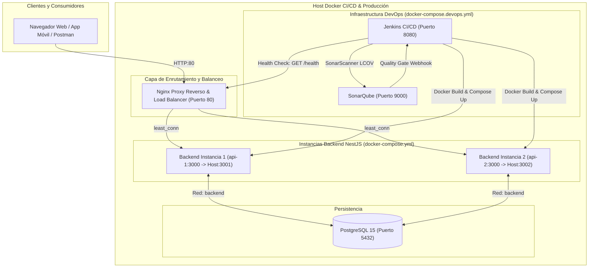

# Documentación DevOps: Arquitectura Modular, Flujo CI/CD, SonarQube y Alta Disponibilidad

**Proyecto:** Riwi Cine Backend (Migración NestJS)  
**Repositorio:** `cine-backend-nest`  
**Estructura:** Modular (`/app/` encapsulado, `/jenkins/` y `/nginx/` independientes)  
**Stack CI/CD & Despliegue:** Jenkins LTS (JDK 21 + Node 22), SonarQube Community, Nginx (Load Balancer), Docker & Docker Compose (Multi-Instancia)  
**Rama Base y Despliegue:** `main`  

---

## 1. Arquitectura Modular y Desacoplada

La estructura del repositorio se organiza bajo el principio de separación de responsabilidades:
* **/app/**: Contiene el código fuente íntegro de la aplicación NestJS, pruebas, dependencias y su respectivo `Dockerfile` de producción.
* **/jenkins/**: Contiene la definición inmutable del servidor de automatización CI/CD con JDK 21, plugins declarativos, Docker CLI y Node 22.
* **/nginx/**: Contiene la configuración del proxy inverso y balanceador de carga (`least_conn`) para orquestar múltiples réplicas del backend.
* **Raíz del Proyecto**: Contiene las orquestaciones `docker-compose.yml`, `docker-compose.devops.yml`, el pipeline declarativo `Jenkinsfile`, hooks de Git y variables de entorno.

```text
cine-backend-nest/
├── app/                              # Aplicación NestJS Encapsulada
│   ├── src/                          # Código fuente (módulos, controladores, servicios)
│   ├── test/                         # Pruebas e2e e integración
│   ├── Dockerfile                    # Multi-stage build (Node 22 Alpine, no-root)
│   ├── .dockerignore                 # Exclusión de artefactos en build
│   ├── package.json                  # Scripts y dependencias
│   ├── tsconfig.json                 # Configuración TypeScript
│   ├── sonar-project.properties      # Configuración de escaneo SonarQube
│   └── vitest.config.ts              # Vitest con generación de reporte LCOV
├── jenkins/                          # Servidor de Automatización
│   ├── Dockerfile                    # Jenkins LTS + Sonar Plugin + Node 22 + Docker CLI
│   └── Jenkinsfile                   # Respaldo del pipeline declarativo
├── nginx/                            # Proxy Reverso y Load Balancer
│   └── default.conf                  # Upstream least_conn hacia api-1 y api-2
├── docs/                             # Documentación técnica
├── .husky/                           # Git Hooks (commit-msg, pre-commit)
├── docker-compose.yml                # Orquestación de DB, api-1, api-2 y Nginx
├── docker-compose.devops.yml         # Orquestación de Jenkins y SonarQube
├── Jenkinsfile                       # Pipeline CI/CD Declarativo (11 etapas)
├── .env.example                      # Plantilla pública de variables de entorno
└── .gitignore                        # Reglas de exclusión de Git
```

---

## 2. Diagrama de Flujo y Alta Disponibilidad (Multi-Instancia)



---

## 3. Configuración del Balanceador Nginx (`nginx/default.conf`)

Nginx distribuye las peticiones entre las instancias activas de la API y ofrece tolerancia a fallos:

```nginx
upstream backend_api {
    # Distribuye el tráfico a la instancia con menor número de conexiones
    least_conn;

    # Múltiples instancias de la API NestJS
    server api-1:3000 max_fails=3 fail_timeout=10s;
    server api-2:3000 max_fails=3 fail_timeout=10s;
}

server {
    listen 80;
    server_name localhost;

    client_max_body_size 20M;

    proxy_set_header Host $host;
    proxy_set_header X-Real-IP $remote_addr;
    proxy_set_header X-Forwarded-For $proxy_add_x_forwarded_for;
    proxy_set_header X-Forwarded-Proto $scheme;

    proxy_http_version 1.1;
    proxy_set_header Upgrade $http_upgrade;
    proxy_set_header Connection 'upgrade';

    # Reintento transparente a la otra instancia si una falla
    proxy_next_upstream error timeout invalid_header http_500 http_502 http_503 http_504;

    location / {
        proxy_pass http://backend_api;
    }

    location /health {
        proxy_pass http://backend_api/health;
    }
}
```

---

## 4. Pipeline Declarativo de Jenkins (`Jenkinsfile`)

El pipeline ejecuta **11 etapas** operando limpiamente sobre el subdirectorio `app/`:

```text
 1. Checkout Information ──▶ Muestra repositorio, rama y commit hash
 2. Install Dependencies  ──▶ npm ci dentro de app/
 3. Lint                  ──▶ npm run lint (ESLint) en app/
 4. Unit Tests            ──▶ npm test (Vitest) en app/
 5. Coverage              ──▶ npm run test:cov en app/ (genera app/coverage/lcov.info)
 6. Build                 ──▶ npm run build en app/ (compila app/dist/main.js)
 7. SonarQube Analysis    ──▶ Escaneo SAST con sonar-scanner apuntando a app/
 8. Quality Gate          ──▶ waitForQualityGate: aborta si no supera el gate
 9. Docker Build          ──▶ docker build -f app/Dockerfile -t cine-backend-nest:latest app
10. Deploy                ──▶ docker compose up -d api-1 api-2 nginx
11. Health Check          ──▶ Verificación activa a través del balanceador Nginx (HTTP 200)
```

---

## 5. Instrucciones de Despliegue y Uso

### 5.1. Levantar la Aplicación con Múltiples Instancias
```bash
# Copiar plantilla de variables si no existe .env
cp .env.example .env

# Construir y levantar PostgreSQL, migraciones, instancias de API y Nginx
docker compose up -d --build
```
* **API a través del balanceador Nginx:** [http://localhost:80/api/v1](http://localhost:80/api/v1)
* **Documentación Swagger:** [http://localhost:80/api/docs](http://localhost:80/api/docs)
* **Health Check balanceado:** [http://localhost:80/health](http://localhost:80/health)

### 5.2. Cómo Cambiar Dinámicamente el Número de Instancias
Tienes dos formas inmediatas de cambiar el número de instancias sin modificar Nginx ni la configuración de red:

#### Método A: Desde el archivo `.env` (Declarativo)
En tu archivo `.env`, cambia la variable `API_REPLICAS`:
```ini
API_REPLICAS=3   # O 1, 2, 4, 5... según necesites
```
Luego aplica los cambios:
```bash
docker compose up -d
```

#### Método B: Vía terminal con el parámetro `--scale` (Bajo demanda)
Sin tocar ningún archivo, puedes escalar o reducir en caliente:
```bash
# Escalar a 3 instancias
docker compose up -d --scale api=3

# Reducir a 1 sola instancia
docker compose up -d --scale api=1
```

* **¿Cómo sabe Nginx cuántas instancias hay?**
  Nginx tiene configurado el resolver de Docker (`127.0.0.11 valid=5s`). Cada vez que escalas o reduces instancias, Docker registra o desregistra las IPs internas bajo el nombre `api`. Nginx consulta ese DNS dinámicamente y distribuye las peticiones automáticamente mediante round-robin entre todas las instancias activas.

### 5.3. Levantar los Servidores DevOps (Jenkins + SonarQube)
```bash
docker compose -f docker-compose.devops.yml up -d --build
```
* **Jenkins:** [http://localhost:8080](http://localhost:8080)
* **SonarQube:** [http://localhost:9000](http://localhost:9000)

### 5.4. Monitoreo con Zabbix 7.0 LTS
Para supervisar la salud de los contenedores Docker, consumo de CPU/RAM de la API NestJS, PostgreSQL y alertas:

```bash
docker compose -f docker-compose.monitoring.yml up -d
```
* **Zabbix Web UI:** [http://localhost:8088](http://localhost:8088)
* **Credenciales por defecto:** Usuario `Admin` / Contraseña `zabbix`
* **Zabbix Server:** Puerto `10051`
* **Zabbix Agent 2:** Puerto `10050` (conectado al socket Docker para métricas en tiempo real)

### 5.5. Proxmox VE en la Arquitectura
En la infraestructura de producción o laboratorios Riwi:
1. **Proxmox VE (Hipervisor Tipo 1):** Actúa como el servidor base de virtualización (KVM/LXC).
2. **Máquinas Virtuales:** Dentro de Proxmox se crean las VMs donde corre el Docker Engine para ejecutar este proyecto (`cine-backend-nest`).
3. **Monitoreo con Zabbix:** El servidor Zabbix puede monitorear tanto el hipervisor Proxmox VE (usando la plantilla oficial *Proxmox VE by HTTP*) como cada una de las VMs y contenedores Docker.


