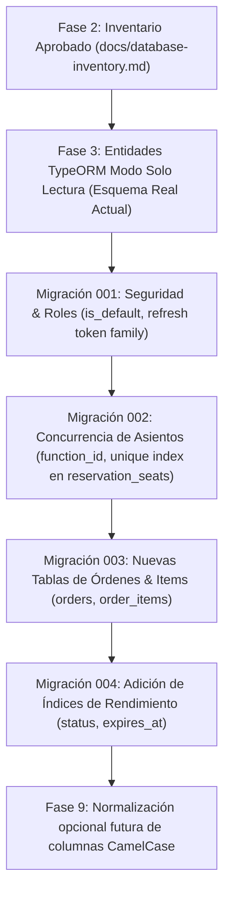

# Inventario de Base de Datos: Modelos Sequelize vs. Esquema PostgreSQL vs. Entidades TypeORM

**Documento:** `docs/database-inventory.md`  
**Proyecto:** Riwi Cine Backend — Migración a NestJS  
**Repositorio Origen:** `https://github.com/manulzweb/riwi-cine-backend-1`  
**Repositorio Destino:** `cine-backend-nest`  
**Fecha de Relevamiento:** 2026-10-05  
**Estado:** Entregable Técnico Fase 2 — Pendiente de Aprobación para Creación de Migraciones  

---

## 1. Estado del Documento y Metodología

### 1.1 Propósito
Este inventario constituye el **primer entregable técnico obligatorio de la Fase 2** del plan de migración (`PLAN_MIGRACION_RIWI_CINE_NESTJS.md`). Su objetivo es contrastar de manera exhaustiva el 100% de los modelos Sequelize ubicados en `app/src/models` del repositorio de referencia con la estructura física real generada en PostgreSQL, identificando tipos de datos, restricciones, claves foráneas, índices, valores por defecto, discrepancias de nomenclatura y las transformaciones necesarias para las futuras entidades TypeORM en NestJS.

### 1.2 Regla de Salvaguarda del Esquema Existente
Conforme a la Sección 1.2 y 3.3 del Plan de Migración:
- **`synchronize: false`** es una regla inquebrantable en todos los entornos.
- **Ninguna migración destructiva** será ejecutada sobre la base de datos de producción o staging.
- Las entidades TypeORM iniciales deben adaptarse al esquema **realmente existente** en la base de datos (incluso con sus inconsistencias de nomenclatura) antes de intentar cualquier normalización de nombres o adición de restricciones.
- Las modificaciones estructurales se aplicarán mediante migraciones versionadas y controladas de TypeORM CLI una vez que el backend NestJS haya demostrado estabilidad en modo solo lectura.

---

## 2. Matriz Maestra de Correspondencia (30 Modelos)

La siguiente tabla resume la correspondencia entre los modelos Sequelize inspeccionados en `app/src/models`, los nombres de tabla físicos en PostgreSQL, las entidades TypeORM planificadas, los módulos propietarios en NestJS, sus claves primarias/foráneas, soporte de soft delete y las transformaciones requeridas:

| # | Modelo Sequelize | Tabla Física BD | Entidad TypeORM | Módulo NestJS | PK | FKs Principales | Timestamps | Soft Delete | Transformación / Acción Requerida |
|---|---|---|---|---|---|---|---|---|---|
| 1 | `Role` | `roles` | `Role` | `users` | `id` (int) | Ninguna | ❌ No | ❌ No | Agregar `is_default` (bool), `created_at`, `updated_at` e índice único parcial `uq_roles_single_default`. |
| 2 | `User` | `users` | `User` | `users` | `id` (int) | `role_id` -> `roles(id)` | ✅ Sí (`snake`) | ❌ No | Mantener campos de bloqueo, activación y consentimientos. `password_hash` es nullable. |
| 3 | `Profile` | `profiles` | `Profile` | `users` | `id` (int) | `user_id`, `city_id`, `favorite_cinema_id` | ✅ Sí (`snake`) | ❌ No | En Sequelize falta `UNIQUE` en `user_id`; TypeORM debe imponer `@OneToOne` con constraint unique. `birth_date` es `DATE` (`DATEONLY`). |
| 4 | `EmailVerificationToken` | `email_verification_tokens` | `EmailVerificationToken` | `auth` | `id` (int) | `user_id` -> `users(id)` | ✅ Sí (`snake`) | ❌ No | Generado por `base-token-schema.ts`. Expiración por `expires_at` y `used_at IS NOT NULL`. |
| 5 | `PasswordResetToken` | `password_reset_tokens` | `PasswordResetToken` | `auth` | `id` (int) | `user_id` -> `users(id)` | ✅ Sí (`snake`) | ❌ No | Generado por `base-token-schema.ts`. Mismo patrón que verificación de email. |
| 6 | `RefreshToken` | `refresh_tokens` | `RefreshToken` | `auth` | `id` (int) | `user_id` -> `users(id)` | ✅ Sí (`snake`) | ❌ No | En Sequelize solo tiene `is_revoked`. Para rotación de familias (§7.9) se requiere migración: agregar `token_family`, `replaced_by_token_id`, `revoked_at`, `last_used_at`. |
| 7 | `LoginAudit` | `login_audits` | `LoginAudit` | `auth` | `id` (int) | `user_id` (nullable) | ✅ Sí (`snake`) | ❌ No | `device_user_agent` es `VARCHAR(255)` (riesgo de desbordamiento; migrar a `TEXT`). Inmutable. |
| 8 | `Country` | `countries` | `Country` | `locations` | `id` (int) | Ninguna | ❌ No | ❌ No | Columna de estado es `"isActive"` (CamelCase en BD). Sin timestamps. |
| 9 | `Department` | `departments` | `Department` | `locations` | `id` (int) | `country_id` -> `countries(id)` | ❌ No | ❌ No | Columna de estado es `"isActive"` (CamelCase en BD). Agregar índice compuesto `(country_id, name)`. |
| 10 | `City` | `cities` | `City` | `locations` | `id` (int) | `department_id` -> `departments(id)` | ❌ No | ❌ No | Columna `"isActive"` (CamelCase). Sin timestamps. Agregar índice `(department_id, name)`. |
| 11 | `Cinema` | `cinemas` | `Cinema` | `cinemas` | `id` (int) | `city_id` -> `cities(id)` | ✅ Sí (`Camel`) | ❌ No | `city_id` es nullable en Sequelize (anomalía de dominio; corregir a `NOT NULL`). `"isActive"`, `"createdAt"`, `"updatedAt"` en CamelCase. |
| 12 | `Room` | `rooms` | `Room` | `cinemas` | `id` (int) | `"cinemaId"` -> `cinemas(id)` | ✅ Sí (`Camel`) | ❌ No | **ALTO RIESGO:** Columna física es `"cinemaId"` (CamelCase) por falta de `field: 'cinema_id'`. `"isActive"`, `"createdAt"`, `"updatedAt"`. |
| 13 | `SeatType` | `seat_types` | `SeatType` | `cinemas` | `id` (int) | Ninguna | ✅ Sí (`Camel`) | ❌ No | `name` es UNIQUE. `price_factor` es `DECIMAL(10,2)`. `"createdAt"`, `"updatedAt"` en CamelCase. |
| 14 | `Seat` | `seats` | `Seat` | `cinemas` | `id` (int) | `room_id`, `seat_type_id` | ✅ Sí (`Camel`) | ❌ No | Falta restricción UNIQUE sobre `(room_id, row, number)`. Distinguir `is_active` (operatividad) de disponibilidad dinámica de reservas. |
| 15 | `Movie` | `movies` | `Movie` | `movies` | `id` (int) | Ninguna | ✅ Sí (`Camel`) | ❌ No | **ALTO RIESGO:** Toda la tabla usa CamelCase (`"releaseDate"`, `"posterUrl"`, `"averageRating"`, etc.). Columnas redundantes (`genres` array vs `genre` string; `active` vs `isActive`). |
| 16 | `CinemaFunction` | `functions` | `CinemaFunction` | `showtimes` | `id` (int) | `movieId` -> `movies(id)`, `roomId` -> `rooms(id)` | ✅ Sí (`Camel`) | ❌ No | **ALTO RIESGO:** Nombre reservado SQL (`functions`). Columnas en CamelCase (`"movieId"`, `"roomId"`, `"startTime"`, `"availableSeats"`). `price` es `FLOAT`; migrar a `DECIMAL(10,2)`. |
| 17 | `NotificationPreference` | `notification_preferences` | `NotificationPreference` | `notifications` | `id` (int) | `user_id` -> `users(id)` | ✅ Sí (`snake`) | ❌ No | Relación 1:1 estricta con `users` (UNIQUE en `user_id`). Banderas de email, sms, push. |
| 18 | `UpcomingMovieNotification` | `upcoming_movie_notifications` | `UpcomingMovieNotification` | `notifications` | `id` (int) | `user_id`, `movie_id` | ✅ Sí (`snake`) | ❌ No | Índice único compuesto `(user_id, movie_id)`. Se conserva `notified_at` para el worker de avisos. |
| 19 | `MembershipLevel` | `membership_levels` | `MembershipLevel` | `loyalty` | `id` (int) | Ninguna | ❌ No | ❌ No | Catálogo de niveles (`BÁSICA`, `ESTÁNDAR`, `PREMIUM`). Sin timestamps (`timestamps: false`). |
| 20 | `MembershipStatus` | `membership_statuses` | `MembershipStatus` | `loyalty` | `id` (int) | Ninguna | ❌ No | ❌ No | Catálogo de estados (`Activa`, `Inactiva`). Sin timestamps (`timestamps: false`). |
| 21 | `Membership` | `memberships` | `Membership` | `loyalty` | `id` (int) | `user_id`, `level_id`, `status_id` | ✅ Sí (`snake`) | ❌ No | Relación 1:1 con `users`. `code` es UNIQUE. `points_balance` acumula puntos de fidelización in-place. |
| 22 | `BonusWallet` | `bonus_wallets` | `BonusWallet` | `loyalty` | `id` (int) | `user_id` -> `users(id)` | ✅ Sí (`snake`) | ❌ No | Relación 1:1 con `users`. Saldo promocional monetario (`balance`), independiente de los puntos de membresía. |
| 23 | `Reservation` | `reservations` | `Reservation` | `reservations` | `id` (int) | `user_id`, `function_id` | ✅ Sí (`Camel`) | ❌ No | Estados: `ACTIVE`, `EXPIRED`, `RELEASED`, `CONFIRMED`. Expiración perezosa por `expires_at`. Timestamps en CamelCase (`createdAt`, `updatedAt`). |
| 24 | `ReservationSeat` | `reservation_seats` | `ReservationSeat` | `reservations` | `id` (int) | `reservation_id`, `seat_id` | ✅ Sí (`Camel`) | ❌ No | **BRECHA CRÍTICA DE CONCURRENCIA:** Falta `function_id` y `expires_at`. Requiere migración para agregar `function_id` y crear restricción única `(function_id, seat_id)`. |
| 25 | `Snack` | `snacks` | `Snack` | `snacks` | `id` (int) | Ninguna | ✅ Sí (`Camel`) | ❌ No | `imageUrl` y `discountPercentage` quedaron en CamelCase en BD (`underscored: false`). Agregar check `stock >= 0`. |
| 26 | `Promotion` | `promotions` | `Promotion` | `snacks` | `id` (int) | `snack_id` -> `snacks(id)` | ✅ Sí (`snake`) | ❌ No | Promociones asociadas a snacks (`discount_type`, `discount_value`). Agregar check `end_date >= start_date`. |
| 27 | `Cart` | `carts` | `Cart` | `cart` | `id` (int) | `user_id` -> `users(id)` | ✅ Sí (`snake`) | ❌ No | Estados: `ACTIVE`, `EXPIRED`, `CONVERTED`. Posee índice único parcial: `user_id WHERE status = 'ACTIVE'`. Soporta `giftcard_amount`. |
| 28 | `CartItem` | `cart_items` | `CartItem` | `cart` | `id` (int) | `cart_id` -> `carts(id)`, `snack_id` -> `snacks(id)` | ✅ Sí (`snake`) | ❌ No | Items de confitería en carrito. Agregar check `quantity > 0`. |
| 29 | `CartTicket` | `cart_tickets` | `CartTicket` | `cart` | `id` (int) | `cart_id`, `function_id`, `reservation_id` | ✅ Sí (`snake`) | ❌ No | Boletos en carrito. Desnormaliza `function_id` y `reservation_id`. Validar `total >= 0`. |
| 30 | `PurchaseHistory` | `purchase_histories` | `Order` / `OrderItem` *(Nueva)* | `orders` | `id` (int) | `user_id` -> `users(id)` | ✅ Sí (`snake`) | ❌ No | **REFACTORING ESTRUCTURAL:** La tabla actual solo guarda contadores escalares (`total_purchases`, `total_spent`). Se reemplaza por modelo completo transaccional de órdenes e items. |

---

## 3. Inventario Detallado de Modelos por Feature

---

### 3.1 Módulo `users` & `auth`

#### 3.1.1 Modelo `Role`
- **Archivo:** `app/src/models/role.model.ts`
- **Tabla:** `roles`
- **Opciones Sequelize:** `timestamps: false`, `underscored: false`, `paranoid: false`.
- **Columnas:**

| Columna Físico BD | Atributo TS | Tipo Sequelize | Tipo PostgreSQL | PK | AutoInc | Nullable | Default | Unique |
|---|---|---|---|---|---|---|---|---|
| `id` | `id` | `INTEGER` | `INTEGER` | **Sí** | **Sí** | No | Nextval | **Sí** |
| `name` | `name` | `STRING(40)` | `VARCHAR(40)` | No | No | No | *None* | **Sí** |
| `description` | `description` | `STRING(160)` | `VARCHAR(160)` | No | No | **Sí** | `null` | No |

- **Asociaciones:** `Role.hasMany(User, { foreignKey: 'role_id', as: 'users' })`.
- **Discrepancias vs Plan de Migración:**
  - El plan (§6.3, §8.2) exige `is_default` (boolean) e índice único parcial `CREATE UNIQUE INDEX uq_roles_single_default ON roles (is_default) WHERE is_default = true`. No existe en Sequelize.
  - El plan exige timestamps de auditoría (`created_at`, `updated_at`). Sequelize los desactivó (`timestamps: false`).
- **Plan de Acción:** Crear migración TypeORM para agregar `is_default`, `created_at`, `updated_at` y el índice único parcial sin romper roles existentes.

---

#### 3.1.2 Modelo `User`
- **Archivo:** `app/src/models/user.model.ts`
- **Tabla:** `users`
- **Opciones Sequelize:** `timestamps: true`, `underscored: true`, `paranoid: false`.
- **Columnas:**

| Columna Físico BD | Atributo TS | Tipo Sequelize | Tipo PostgreSQL | PK | AutoInc | Nullable | Default | Unique |
|---|---|---|---|---|---|---|---|---|
| `id` | `id` | `INTEGER` | `INTEGER` | **Sí** | **Sí** | No | Nextval | **Sí** |
| `role_id` | `roleId` | `INTEGER` | `INTEGER` | No | No | No | *None* | No |
| `email` | `email` | `STRING(255)` | `VARCHAR(255)` | No | No | No | *None* | **Sí** |
| `password_hash` | `passwordHash` | `STRING(255)` | `VARCHAR(255)` | No | No | **Sí** | `null` | No |
| `is_active` | `isActive` | `BOOLEAN` | `BOOLEAN` | No | No | No | `false` | No |
| `activated_at` | `activatedAt` | `DATE` | `TIMESTAMPTZ` | No | No | **Sí** | `null` | No |
| `email_verified_at` | `emailVerifiedAt` | `DATE` | `TIMESTAMPTZ` | No | No | **Sí** | `null` | No |
| `failed_login_attempts` | `failedLoginAttempts` | `INTEGER` | `INTEGER` | No | No | No | `0` | No |
| `locked_until` | `lockedUntil` | `DATE` | `TIMESTAMPTZ` | No | No | **Sí** | `null` | No |
| `last_login_at` | `lastLoginAt` | `DATE` | `TIMESTAMPTZ` | No | No | **Sí** | `null` | No |
| `personal_data_consent` | `personalDataConsent` | `BOOLEAN` | `BOOLEAN` | No | No | No | `false` | No |
| `terms_consent` | `termsConsent` | `BOOLEAN` | `BOOLEAN` | No | No | No | `false` | No |
| `commercial_consent` | `commercialConsent` | `BOOLEAN` | `BOOLEAN` | No | No | No | `false` | No |
| `created_at` | `createdAt` | `DATE` | `TIMESTAMPTZ` | No | No | No | `now()` | No |
| `updated_at` | `updatedAt` | `DATE` | `TIMESTAMPTZ` | No | No | No | `now()` | No |

- **Asociaciones:**
  - `User.belongsTo(Role, { foreignKey: 'role_id', as: 'role' })`
  - `User.hasOne(Profile, { foreignKey: 'user_id', as: 'profile' })`
  - `User.hasOne(Membership, { foreignKey: 'user_id', as: 'membership' })`
  - `User.hasOne(BonusWallet, { foreignKey: 'user_id', as: 'bonusWallet' })`
  - `User.hasOne(NotificationPreference, { foreignKey: 'user_id', as: 'notificationPreference' })`
  - `User.hasOne(Cart, { foreignKey: 'user_id', as: 'cart' })`
  - `User.hasMany(RefreshToken, { foreignKey: 'user_id', as: 'refreshTokens' })`
  - `User.hasMany(LoginAudit, { foreignKey: 'user_id', as: 'loginAudits' })`
  - `User.hasMany(EmailVerificationToken, { foreignKey: 'user_id', as: 'emailVerificationTokens' })`
  - `User.hasMany(PasswordResetToken, { foreignKey: 'user_id', as: 'passwordResetTokens' })`
- **Notas:** `password_hash` es nullable porque soporta usuarios registrados con flujos sociales o pendientes de activación de contraseña.

---

#### 3.1.3 Modelo `Profile`
- **Archivo:** `app/src/models/profile.model.ts`
- **Tabla:** `profiles`
- **Opciones Sequelize:** `timestamps: true`, `underscored: true`, `paranoid: false`.
- **Columnas:**

| Columna Físico BD | Atributo TS | Tipo Sequelize | Tipo PostgreSQL | PK | AutoInc | Nullable | Default | Unique |
|---|---|---|---|---|---|---|---|---|
| `id` | `id` | `INTEGER` | `INTEGER` | **Sí** | **Sí** | No | Nextval | **Sí** |
| `user_id` | `userId` | `INTEGER` | `INTEGER` | No | No | No | *None* | ⚠️ No en BD |
| `first_name` | `firstName` | `STRING(100)` | `VARCHAR(100)` | No | No | No | *None* | No |
| `last_name` | `lastName` | `STRING(100)` | `VARCHAR(100)` | No | No | No | *None* | No |
| `document_type` | `documentType` | `STRING(20)` | `VARCHAR(20)` | No | No | No | *None* | No |
| `document_number` | `documentNumber` | `STRING(30)` | `VARCHAR(30)` | No | No | No | *None* | No |
| `birth_date` | `birthDate` | `DATE` | `DATE` (`DATEONLY`) | No | No | No | *None* | No |
| `gender` | `gender` | `STRING(20)` | `VARCHAR(20)` | No | No | **Sí** | `null` | No |
| `phone` | `phone` | `STRING(20)` | `VARCHAR(20)` | No | No | No | *None* | No |
| `city_id` | `cityId` | `INTEGER` | `INTEGER` | No | No | No | *None* | No |
| `favorite_cinema_id` | `favoriteCinemaId` | `INTEGER` | `INTEGER` | No | No | **Sí** | `null` | No |
| `created_at` | `createdAt` | `DATE` | `TIMESTAMPTZ` | No | No | No | `now()` | No |
| `updated_at` | `updatedAt` | `DATE` | `TIMESTAMPTZ` | No | No | No | `now()` | No |

- **Asociaciones:**
  - `Profile.belongsTo(User, { foreignKey: 'user_id', as: 'user' })`
  - `Profile.belongsTo(City, { foreignKey: 'city_id', as: 'city' })`
  - `Profile.belongsTo(Cinema, { foreignKey: 'favorite_cinema_id', as: 'favoriteCinema' })`
- **Discrepancias:** En Sequelize no se configuró `unique: true` en `user_id`. TypeORM debe forzar `@OneToOne(() => User)` con `@JoinColumn({ name: 'user_id' })` y agregar la restricción `UNIQUE` formal en la migración. `birth_date` es tipo fecha pura (`DATE`), no timestamp.

---

#### 3.1.4 Modelos de Tokens (`EmailVerificationToken` y `PasswordResetToken`)
- **Archivos:** `app/src/models/email-verification-token.model.ts`, `app/src/models/password-reset-token.model.ts`, `app/src/models/common/base-token-schema.ts`
- **Tablas:** `email_verification_tokens`, `password_reset_tokens`
- **Opciones Sequelize:** `timestamps: true`, `underscored: true`, `paranoid: false`.
- **Columnas idénticas en ambas tablas:**

| Columna Físico BD | Atributo TS | Tipo Sequelize | Tipo PostgreSQL | PK | AutoInc | Nullable | Default | Unique |
|---|---|---|---|---|---|---|---|---|
| `id` | `id` | `INTEGER` | `INTEGER` | **Sí** | **Sí** | No | Nextval | **Sí** |
| `user_id` | `userId` | `INTEGER` | `INTEGER` | No | No | No | *None* | No |
| `token_hash` | `tokenHash` | `STRING(255)` | `VARCHAR(255)` | No | No | No | *None* | No |
| `expires_at` | `expiresAt` | `DATE` | `TIMESTAMPTZ` | No | No | No | *None* | No |
| `used_at` | `usedAt` | `DATE` | `TIMESTAMPTZ` | No | No | **Sí** | `null` | No |
| `created_at` | `createdAt` | `DATE` | `TIMESTAMPTZ` | No | No | No | `now()` | No |
| `updated_at` | `updatedAt` | `DATE` | `TIMESTAMPTZ` | No | No | No | `now()` | No |

- **Notas:** El consumo de token se registra marcando `used_at = now()`. Ambos modelos pertenecen funcionalmente al feature `auth`.

---

#### 3.1.5 Modelo `RefreshToken`
- **Archivo:** `app/src/models/refresh-token.model.ts`
- **Tabla:** `refresh_tokens`
- **Opciones Sequelize:** `timestamps: true`, `underscored: true`, `paranoid: false`.
- **Columnas Actuales en BD:**

| Columna Físico BD | Atributo TS | Tipo Sequelize | Tipo PostgreSQL | PK | AutoInc | Nullable | Default | Unique |
|---|---|---|---|---|---|---|---|---|
| `id` | `id` | `INTEGER` | `INTEGER` | **Sí** | **Sí** | No | Nextval | **Sí** |
| `user_id` | `userId` | `INTEGER` | `INTEGER` | No | No | No | *None* | No |
| `token_hash` | `tokenHash` | `STRING(255)` | `VARCHAR(255)` | No | No | No | *None* | No |
| `expires_at` | `expiresAt` | `DATE` | `TIMESTAMPTZ` | No | No | No | *None* | No |
| `is_revoked` | `isRevoked` | `BOOLEAN` | `BOOLEAN` | No | No | No | `false` | No |
| `created_at` | `createdAt` | `DATE` | `TIMESTAMPTZ` | No | No | No | `now()` | No |
| `updated_at` | `updatedAt` | `DATE` | `TIMESTAMPTZ` | No | No | No | `now()` | No |

- **Discrepancias vs Plan de Migración (§7.9):**
  - El plan exige rotación con detección de reutilización y familia de tokens:
    - `token_family VARCHAR(64)` (UUID de familia)
    - `revoked_at TIMESTAMPTZ`
    - `replaced_by_token_id INTEGER REFERENCES refresh_tokens(id)`
    - `last_used_at TIMESTAMPTZ`
  - Ninguna de estas 4 columnas existe en la base Sequelize actual.
- **Plan de Acción:** Crear migración en TypeORM para incorporar estas columnas sin alterar los tokens activos legados (marcando su familia con un valor por defecto o UUID generado).

---

#### 3.1.6 Modelo `LoginAudit`
- **Archivo:** `app/src/models/login-audit.model.ts`
- **Tabla:** `login_audits`
- **Opciones Sequelize:** `timestamps: true`, `underscored: true`, `paranoid: false`.
- **Columnas:**

| Columna Físico BD | Atributo TS | Tipo Sequelize | Tipo PostgreSQL | PK | AutoInc | Nullable | Default | Unique |
|---|---|---|---|---|---|---|---|---|
| `id` | `id` | `INTEGER` | `INTEGER` | **Sí** | **Sí** | No | Nextval | **Sí** |
| `user_id` | `userId` | `INTEGER` | `INTEGER` | No | No | **Sí** | `null` | No |
| `email_attempted` | `emailAttempted` | `STRING(255)` | `VARCHAR(255)` | No | No | No | *None* | No |
| `ip_address` | `ipAddress` | `STRING(255)` | `VARCHAR(255)` | No | No | **Sí** | `null` | No |
| `device_user_agent` | `deviceUserAgent` | `STRING(255)` | `VARCHAR(255)` | No | No | **Sí** | `null` | No |
| `status` | `status` | `STRING(255)` | `VARCHAR(255)` | No | No | No | *None* | No |
| `created_at` | `createdAt` | `DATE` | `TIMESTAMPTZ` | No | No | No | `now()` | No |
| `updated_at` | `updatedAt` | `DATE` | `TIMESTAMPTZ` | No | No | No | `now()` | No |

- **Observación:** `device_user_agent` con límite de 255 caracteres es susceptible a fallas con navegadores modernos cuyo User-Agent excede 255 caracteres. Se recomienda migrar a `TEXT` en TypeORM.

---

### 3.2 Módulo `locations` & `cinemas`

#### 3.2.1 Modelos Geográficos: `Country`, `Department`, `City`
- **Archivos:** `country.model.ts`, `department.model.ts`, `city.model.ts`
- **Tablas:** `countries`, `departments`, `cities`
- **Opciones Sequelize:** `timestamps: false`, `underscored: false` (con field manual en foreign keys).
- **Columnas:**

**Tabla `countries` (Validada en BD):**
| Columna Físico BD | Atributo TS | Tipo PostgreSQL | PK | AutoInc | Nullable | Default | Unique |
|---|---|---|---|---|---|---|---|
| `id` | `id` | `INTEGER` | **Sí** | **Sí** | No | Nextval | **Sí** |
| `name` | `name` | `VARCHAR(100)` | No | No | No | *None* | No |
| `"isActive"` | `isActive` | `BOOLEAN` | No | No | No | `true` | No |

*Nota de Validación:* La columna `code` documentada en el modelo de dominio no existe físicamente en la tabla PostgreSQL.

**Tabla `departments`:**
| Columna Físico BD | Atributo TS | Tipo PostgreSQL | PK | AutoInc | Nullable | Default | Unique |
|---|---|---|---|---|---|---|---|
| `id` | `id` | `INTEGER` | **Sí** | **Sí** | No | Nextval | **Sí** |
| `country_id` | `countryId` | `INTEGER` (FK a `countries`) | No | No | No | *None* | No |
| `name` | `name` | `VARCHAR(100)` | No | No | No | *None* | No |
| `"isActive"` | `isActive` | `BOOLEAN` | No | No | No | `true` | No |

**Tabla `cities`:**
| Columna Físico BD | Atributo TS | Tipo PostgreSQL | PK | AutoInc | Nullable | Default | Unique |
|---|---|---|---|---|---|---|---|
| `id` | `id` | `INTEGER` | **Sí** | **Sí** | No | Nextval | **Sí** |
| `department_id` | `departmentId` | `INTEGER` (FK a `departments`) | No | No | No | *None* | No |
| `name` | `name` | `VARCHAR(100)` | No | No | No | *None* | No |
| `"isActive"` | `isActive` | `BOOLEAN` | No | No | No | `true` | No |

- **Anomalías de Nomenclatura:** La columna booleana de estado se creó físicamente como `"isActive"` (CamelCase entre comillas) en las 3 tablas.
- **Sin Timestamps:** Ninguna de las tres tablas geográficas posee `created_at` ni `updated_at`.

---

#### 3.2.2 Modelo `Cinema`
- **Archivo:** `app/src/models/cinema.model.ts`
- **Tabla:** `cinemas`
- **Opciones Sequelize:** `timestamps: true`, `underscored: false` (usó manual `field: 'city_id'`).
- **Columnas:**

| Columna Físico BD | Atributo TS | Tipo PostgreSQL | PK | AutoInc | Nullable | Default | Unique |
|---|---|---|---|---|---|---|---|
| `id` | `id` | `INTEGER` | **Sí** | **Sí** | No | Nextval | **Sí** |
| `city_id` | `cityId` | `INTEGER` (FK a `cities`) | No | No | ⚠️ **Sí** | `null` | No |
| `name` | `name` | `VARCHAR(100)` | No | No | No | *None* | No |
| `address` | `address` | `VARCHAR(200)` | No | No | No | *None* | No |
| `"isActive"` | `isActive` | `BOOLEAN` | No | No | No | `true` | No |
| `"createdAt"` | `createdAt` | `TIMESTAMPTZ` | No | No | No | `now()` | No |
| `"updatedAt"` | `updatedAt` | `TIMESTAMPTZ` | No | No | No | `now()` | No |

- **Discrepancia Crítica:** `city_id` permite valores nulos (`allowNull: true`), lo cual no tiene sentido en el dominio de cines (un cine siempre debe pertenecer a una ciudad). Además, los timestamps físicos quedaron en CamelCase (`"createdAt"`, `"updatedAt"`).

---

#### 3.2.3 Modelo `Room`
- **Archivo:** `app/src/models/room.model.ts`
- **Tabla:** `rooms`
- **Opciones Sequelize:** `timestamps: true`, `underscored: false`.
- **Columnas:**

| Columna Físico BD | Atributo TS | Tipo PostgreSQL | PK | AutoInc | Nullable | Default | Unique |
|---|---|---|---|---|---|---|---|
| `id` | `id` | `INTEGER` | **Sí** | **Sí** | No | Nextval | **Sí** |
| `"cinemaId"` | `cinemaId` | `INTEGER` (FK a `cinemas`) | No | No | No | *None* | No |
| `name` | `name` | `VARCHAR(50)` | No | No | No | *None* | No |
| `format` | `format` | `VARCHAR(255)` | No | No | No | *None* | No |
| `capacity` | `capacity` | `INTEGER` | No | No | No | *None* | No |
| `"isActive"` | `isActive` | `BOOLEAN` | No | No | No | `true` | No |
| `"createdAt"` | `createdAt` | `TIMESTAMPTZ` | No | No | No | `now()` | No |
| `"updatedAt"` | `updatedAt` | `TIMESTAMPTZ` | No | No | No | `now()` | No |

- **ALTO RIESGO EN TYPEORM:** En `room.model.ts`, el foreign key no utilizó `field: 'cinema_id'`, por lo que Sequelize creó físicamente la columna como `"cinemaId"` en PostgreSQL. TypeORM debe mapear `@Column({ name: 'cinemaId' })` y `@JoinColumn({ name: 'cinemaId' })` para no emitir consultas fallidas hacia `cinema_id`. Falta restricción UNIQUE sobre `("cinemaId", name)`.

---

#### 3.2.4 Modelos `SeatType` y `Seat`
- **Archivos:** `seat-type.model.ts`, `seat.model.ts`
- **Tablas:** `seat_types`, `seats`

**Tabla `seat_types`:**
| Columna Físico BD | Atributo TS | Tipo PostgreSQL | PK | AutoInc | Nullable | Default | Unique |
|---|---|---|---|---|---|---|---|
| `id` | `id` | `INTEGER` | **Sí** | **Sí** | No | Nextval | **Sí** |
| `name` | `name` | `VARCHAR(50)` | No | No | No | *None* | **Sí** |
| `description` | `description` | `VARCHAR(150)` | No | No | **Sí** | `null` | No |
| `price_factor` | `priceFactor` | `DECIMAL(10,2)` | No | No | No | `1.00` | No |
| `"createdAt"` | `createdAt` | `TIMESTAMPTZ` | No | No | No | `now()` | No |
| `"updatedAt"` | `updatedAt` | `TIMESTAMPTZ` | No | No | No | `now()` | No |

**Tabla `seats`:**
| Columna Físico BD | Atributo TS | Tipo PostgreSQL | PK | AutoInc | Nullable | Default | Unique |
|---|---|---|---|---|---|---|---|
| `id` | `id` | `INTEGER` | **Sí** | **Sí** | No | Nextval | **Sí** |
| `room_id` | `roomId` | `INTEGER` (FK a `rooms`) | No | No | No | *None* | No |
| `seat_type_id` | `seatTypeId` | `INTEGER` (FK a `seat_types`) | No | No | No | *None* | No |
| `row` | `row` | `VARCHAR(5)` | No | No | No | *None* | No |
| `number` | `number` | `INTEGER` | No | No | No | *None* | No |
| `is_available` | `isAvailable` | `BOOLEAN` | No | No | No | `true` | No |
| `is_active` | `isActive` | `BOOLEAN` | No | No | No | `true` | No |
| `"createdAt"` | `createdAt` | `TIMESTAMPTZ` | No | No | No | `now()` | No |
| `"updatedAt"` | `updatedAt` | `TIMESTAMPTZ` | No | No | No | `now()` | No |

- **Omisión Crítica de Integridad:** En `seats` no existe restricción `UNIQUE (room_id, row, number)`. Debe crearse en la migración de endurecimiento.
- **Disponibilidad:** `is_available` en `Seat` no debe ser mutado por reservas concurrentes; la disponibilidad dinámica se rige exclusivamente por `reservation_seats`.

---

### 3.3 Módulo `movies` & `showtimes`

#### 3.3.1 Modelo `Movie`
- **Archivo:** `app/src/models/movie.model.ts`
- **Tabla:** `movies`
- **Opciones Sequelize:** `timestamps: true`, `underscored: false`, `paranoid: false`.
- **Columnas:**

| Columna Físico BD | Atributo TS | Tipo Sequelize | Tipo PostgreSQL | PK | AutoInc | Nullable | Default |
|---|---|---|---|---|---|---|---|
| `id` | `id` | `INTEGER` | `INTEGER` | **Sí** | **Sí** | No | Nextval |
| `title` | `title` | `STRING(255)` | `VARCHAR(255)` | No | No | No | *None* |
| `synopsis` | `synopsis` | `TEXT` | `TEXT` | No | No | No | *None* |
| `director` | `director` | `STRING(255)` | `VARCHAR(255)` | No | No | No | *None* |
| `actors` | `actors` | `ARRAY(STRING)` | `text[]` | No | No | No | `[]` |
| `genres` | `genres` | `ARRAY(STRING)` | `text[]` | No | No | No | `[]` |
| `languages` | `languages` | `ARRAY(STRING)` | `text[]` | No | No | No | `[]` |
| `formats` | `formats` | `ARRAY(STRING)` | `text[]` | No | No | No | `[]` |
| `duration` | `duration` | `INTEGER` | `INTEGER` | No | No | No | *None* |
| `classification` | `classification` | `STRING(50)` | `VARCHAR(50)` | No | No | No | *None* |
| `"releaseDate"` | `releaseDate` | `DATE` | `DATE` (`DATEONLY`) | No | No | No | *None* |
| `"posterUrl"` | `posterUrl` | `STRING(255)` | `VARCHAR(255)` | No | No | No | *None* |
| `"bannerUrl"` | `bannerUrl` | `STRING(255)` | `VARCHAR(255)` | No | No | **Sí** | `null` |
| `"trailerUrl"` | `trailerUrl` | `STRING(255)` | `VARCHAR(255)` | No | No | **Sí** | `null` |
| `"averageRating"` | `averageRating` | `DECIMAL(3,2)` | `NUMERIC(3,2)` | No | No | No | `0.00` |
| `active` | `active` | `BOOLEAN` | `BOOLEAN` | No | No | No | `true` |
| `genre` | `genre` | `STRING(100)` | `VARCHAR(100)` | No | No | **Sí** | `null` |
| `language` | `language` | `STRING(50)` | `VARCHAR(50)` | No | No | **Sí** | `null` |
| `"isSubtitled"` | `isSubtitled` | `BOOLEAN` | `BOOLEAN` | No | No | **Sí** | `false` |
| `rating` | `rating` | `FLOAT` | `DOUBLE PRECISION` | No | No | **Sí** | `0` |
| `"isActive"` | `isActive` | `BOOLEAN` | `BOOLEAN` | No | No | No | `true` |
| `"createdAt"` | `createdAt` | `DATE` | `TIMESTAMPTZ` | No | No | No | `now()` |
| `"updatedAt"` | `updatedAt` | `DATE` | `TIMESTAMPTZ` | No | No | No | `now()` |

- **Anomalías Críticas:**
  1. Columnas duplicadas creadas por parches sucesivos de compatibilidad: `genre` vs `genres`, `language` vs `languages`, `rating` vs `averageRating`, `active` vs `isActive`.
  2. Nomenclatura física en CamelCase entre comillas dobles en Postgres (`"releaseDate"`, `"posterUrl"`, `"trailerUrl"`, `"averageRating"`, `"isActive"`, `"isSubtitled"`, `"createdAt"`, `"updatedAt"`).
  3. No tiene soft delete (`paranoid: false`), maneja visibilidad mediante `active`.

---

#### 3.3.2 Modelo `CinemaFunction`
- **Archivo:** `app/src/models/function.model.ts`
- **Tabla:** `functions`
- **Opciones Sequelize:** `timestamps: true`, `underscored: false`, `paranoid: false`.
- **Columnas:**

| Columna Físico BD | Atributo TS | Tipo PostgreSQL | PK | AutoInc | Nullable | Default | Unique |
|---|---|---|---|---|---|---|---|
| `id` | `id` | `INTEGER` | **Sí** | **Sí** | No | Nextval | **Sí** |
| `"movieId"` | `movieId` | `INTEGER` (FK a `movies`) | No | No | No | *None* | No |
| `"roomId"` | `roomId` | `INTEGER` (FK a `rooms`) | No | No | **Sí** | `null` | No |
| `"startTime"` | `startTime` | `TIMESTAMPTZ` | No | No | **Sí** | `null` | No |
| `"endTime"` | `endTime` | `TIMESTAMPTZ` | No | No | **Sí** | `null` | No |
| `price` | `price` | `DOUBLE PRECISION` (`FLOAT`) | No | No | No | *None* | No |
| `"availableSeats"` | `availableSeats` | `INTEGER` | No | No | No | `0` | No |
| `"isActive"` | `isActive` | `BOOLEAN` | No | No | No | `true` | No |
| `format` | `format` | `VARCHAR(255)` | No | No | **Sí** | `null` | No |
| `room` | `room` | `VARCHAR(255)` | No | No | **Sí** | `null` | No |
| `totalSeats` | `totalSeats` | `INTEGER` | No | No | **Sí** | `null` | No |
| `active` | `active` | `BOOLEAN` | No | No | No | `true` | No |
| `"createdAt"` | `createdAt` | `TIMESTAMPTZ` | No | No | No | `now()` | No |
| `"updatedAt"` | `updatedAt` | `TIMESTAMPTZ` | No | No | No | `now()` | No |

- **Riesgos Mayores:**
  1. **Palabra reservada SQL:** La tabla se llama `functions`. En PostgreSQL cualquier consulta SQL directa debe usar comillas dobles (`"functions"`).
  2. **Columnas CamelCase:** `"movieId"`, `"roomId"`, `"startTime"`, `"endTime"`, `"availableSeats"`, `"createdAt"`, `"updatedAt"`.
  3. **Tipado de Moneda:** `price` usa `FLOAT` en vez de `DECIMAL(10,2)`.
  4. **Nulabilidad indebida:** `roomId`, `startTime` y `endTime` permiten `null` en Sequelize.
  5. **Contador desnormalizado:** `availableSeats` se mutaba manualmente. En la nueva arquitectura de NestJS, la disponibilidad se calcula atómicamente a partir de la capacidad de la sala menos los asientos en `reservation_seats`.

---

### 3.4 Módulo `loyalty` & `notifications`

#### 3.4.1 Modelos `MembershipLevel` y `MembershipStatus`
- **Archivos:** `membership-level.model.ts`, `membership-status.model.ts`
- **Tablas:** `membership_levels`, `membership_statuses`
- **Opciones Sequelize:** `timestamps: false`, `underscored: true`, `paranoid: false`.

**Tabla `membership_levels`:**
| Columna Físico BD | Atributo TS | Tipo PostgreSQL | PK | Nullable | Default | Unique |
|---|---|---|---|---|---|---|
| `id` | `id` | `INTEGER` | **Sí** | No | Nextval | **Sí** |
| `name` | `name` | `VARCHAR(50)` | No | No | *None* | **Sí** |
| `description` | `description` | `VARCHAR(150)` | No | **Sí** | `null` | No |
| `discount_percentage` | `discountPercentage` | `DECIMAL(5,2)` | No | No | `0.00` | No |

**Tabla `membership_statuses`:**
| Columna Físico BD | Atributo TS | Tipo PostgreSQL | PK | Nullable | Default | Unique |
|---|---|---|---|---|---|---|
| `id` | `id` | `INTEGER` | **Sí** | No | Nextval | **Sí** |
| `name` | `name` | `VARCHAR(50)` | No | No | *None* | **Sí** |
| `description` | `description` | `VARCHAR(150)` | No | **Sí** | `null` | No |

- **Nota Vital:** No poseen timestamps. Las entidades TypeORM no deben incorporar `@CreateDateColumn()` ni `@UpdateDateColumn()`.

---

#### 3.4.2 Modelo `Membership`
- **Archivo:** `app/src/models/membership.model.ts`
- **Tabla:** `memberships`
- **Opciones Sequelize:** `timestamps: true`, `underscored: true`, `paranoid: false`.
- **Columnas:**

| Columna Físico BD | Atributo TS | Tipo PostgreSQL | PK | Nullable | Default | Unique |
|---|---|---|---|---|---|---|
| `id` | `id` | `INTEGER` | **Sí** | No | Nextval | **Sí** |
| `user_id` | `userId` | `INTEGER` (FK a `users`) | No | No | *None* | **Sí** (1 a 1) |
| `code` | `code` | `VARCHAR(50)` | No | No | *None* | **Sí** |
| `level_id` | `levelId` | `INTEGER` (FK a `membership_levels`) | No | No | *None* | No |
| `status_id` | `statusId` | `INTEGER` (FK a `membership_statuses`) | No | No | *None* | No |
| `points_balance` | `pointsBalance` | `INTEGER` | No | No | `0` | No |
| `created_at` | `createdAt` | `TIMESTAMPTZ` | No | No | `now()` | No |
| `updated_at` | `updatedAt` | `TIMESTAMPTZ` | No | No | `now()` | No |

---

#### 3.4.3 Modelo `BonusWallet`
- **Archivo:** `app/src/models/bonus-wallet.model.ts`
- **Tabla:** `bonus_wallets`
- **Opciones Sequelize:** `timestamps: true`, `underscored: true`, `paranoid: false`.
- **Columnas:**

| Columna Físico BD | Atributo TS | Tipo PostgreSQL | PK | Nullable | Default | Unique |
|---|---|---|---|---|---|---|
| `id` | `id` | `INTEGER` | **Sí** | No | Nextval | **Sí** |
| `user_id` | `userId` | `INTEGER` (FK a `users`) | No | No | *None* | **Sí** (1 a 1) |
| `balance` | `balance` | `DECIMAL(10,2)` | No | No | `0.00` | No |
| `created_at` | `createdAt` | `TIMESTAMPTZ` | No | No | `now()` | No |
| `updated_at` | `updatedAt` | `TIMESTAMPTZ` | No | No | `now()` | No |

- **Diferencia de Negocio:** `BonusWallet.balance` representa saldo monetario a favor (monedero virtual / cashback). `Membership.points_balance` representa puntos de fidelidad redimibles según nivel.

---

#### 3.4.4 Modelos `NotificationPreference` y `UpcomingMovieNotification`
- **Archivos:** `notification-preference.model.ts`, `upcoming-movie-notification.model.ts`
- **Tablas:** `notification_preferences`, `upcoming_movie_notifications`
- **Opciones Sequelize:** `timestamps: true`, `underscored: true`.

**Tabla `notification_preferences`:**
| Columna Físico BD | Atributo TS | Tipo PostgreSQL | PK | Nullable | Default | Unique |
|---|---|---|---|---|---|---|
| `id` | `id` | `INTEGER` | **Sí** | No | Nextval | **Sí** |
| `user_id` | `userId` | `INTEGER` (FK a `users`) | No | No | *None* | **Sí** |
| `email_enabled` | `emailEnabled` | `BOOLEAN` | No | No | `true` | No |
| `sms_enabled` | `smsEnabled` | `BOOLEAN` | No | No | `false` | No |
| `push_enabled` | `pushEnabled` | `BOOLEAN` | No | No | `false` | No |
| `created_at` | `createdAt` | `TIMESTAMPTZ` | No | No | `now()` | No |
| `updated_at` | `updatedAt` | `TIMESTAMPTZ` | No | No | `now()` | No |

**Tabla `upcoming_movie_notifications`:**
| Columna Físico BD | Atributo TS | Tipo PostgreSQL | PK | Nullable | Default | Unique |
|---|---|---|---|---|---|---|
| `id` | `id` | `INTEGER` | **Sí** | No | Nextval | **Sí** |
| `user_id` | `userId` | `INTEGER` (FK a `users`) | No | No | *None* | No |
| `movie_id` | `movieId` | `INTEGER` (FK a `movies`) | No | No | *None* | No |
| `notified_at` | `notifiedAt` | `TIMESTAMPTZ` | No | **Sí** | `null` | No |
| `created_at` | `createdAt` | `TIMESTAMPTZ` | No | No | `now()` | No |
| `updated_at` | `updatedAt` | `TIMESTAMPTZ` | No | No | `now()` | No |

- **Restricción:** Posee índice único compuesto `(user_id, movie_id)`. Se conserva para el servicio de notificación de estrenos.

---

### 3.5 Módulo `reservations` & `snacks`

#### 3.5.1 Modelo `Reservation`
- **Archivo:** `app/src/models/reservation.model.ts`
- **Tabla:** `reservations`
- **Opciones Sequelize:** `timestamps: true`, `underscored: false` (usó `field` manual para columnas clave).
- **Columnas:**

| Columna Físico BD | Atributo TS | Tipo Sequelize | Tipo PostgreSQL | PK | Nullable | Default |
|---|---|---|---|---|---|---|
| `id` | `id` | `INTEGER` | `INTEGER` | **Sí** | No | Nextval |
| `user_id` | `userId` | `INTEGER` | `INTEGER` (FK a `users`) | No | No | *None* |
| `function_id` | `functionId` | `INTEGER` | `INTEGER` (FK a `functions`) | No | No | *None* |
| `status` | `status` | `ENUM` | `VARCHAR(255)` (`ACTIVE`, `EXPIRED`, `RELEASED`, `CONFIRMED`) | No | No | `'ACTIVE'` |
| `expires_at` | `expiresAt` | `DATE` | `TIMESTAMPTZ` | No | **Sí** | `null` |
| `"createdAt"` | `createdAt` | `DATE` | `TIMESTAMPTZ` | No | No | `now()` |
| `"updatedAt"` | `updatedAt` | `DATE` | `TIMESTAMPTZ` | No | No | `now()` |

- **Timestamps:** En la base física quedaron como `"createdAt"` y `"updatedAt"`.
- **Expiración:** Utiliza expiración perezosa mediante `expires_at > now()`.

---

#### 3.5.2 Modelo `ReservationSeat` (Brecha Crítica de Concurrencia)
- **Archivo:** `app/src/models/reservation-seat.model.ts`
- **Tabla:** `reservation_seats`
- **Opciones Sequelize:** `timestamps: true`, `underscored: false`.
- **Columnas Actuales en BD:**

| Columna Físico BD | Atributo TS | Tipo PostgreSQL | PK | Nullable | Default |
|---|---|---|---|---|---|
| `id` | `id` | `INTEGER` | **Sí** | No | Nextval |
| `reservation_id` | `reservationId` | `INTEGER` (FK a `reservations`) | No | No | *None* |
| `seat_id` | `seatId` | `INTEGER` (FK a `seats`) | No | No | *None* |
| `status` | `status` | `VARCHAR(255)` (`LOCKED`, `RELEASED`, `SOLD`) | No | No | `'LOCKED'` |
| `price` | `price` | `NUMERIC(10,2)` | No | No | *None* |
| `"createdAt"` | `createdAt` | `TIMESTAMPTZ` | No | No | `now()` |
| `"updatedAt"` | `updatedAt` | `TIMESTAMPTZ` | No | No | `now()` |

- **HALLAZGO CRÍTICO N.° 1 DEL INVENTARIO:**
  En Sequelize, `reservation_seats` **NO** tiene la columna `function_id` ni `expires_at`, y **NO** posee un índice único que impida a dos transacciones reservar el mismo asiento para la misma función.
  Para satisfacer la Sección 9.3 del plan (`INSERT ... ON CONFLICT (function_id, seat_id) DO UPDATE ... WHERE reservation_seats.expires_at < now()`), **es estrictamente necesario ejecutar una migración en TypeORM** que agregue:
  1. `function_id INTEGER NOT NULL REFERENCES functions(id)`
  2. `expires_at TIMESTAMPTZ`
  3. `CREATE UNIQUE INDEX uq_reservation_seats_function_seat ON reservation_seats (function_id, seat_id);`

---

#### 3.5.3 Modelos `Snack` y `Promotion`
- **Archivos:** `snack.model.ts`, `promotion.model.ts`
- **Tablas:** `snacks`, `promotions`

**Tabla `snacks`:**
| Columna Físico BD | Atributo TS | Tipo PostgreSQL | PK | Nullable | Default |
|---|---|---|---|---|---|
| `id` | `id` | `INTEGER` | **Sí** | No | Nextval |
| `name` | `name` | `VARCHAR(100)` | No | No | *None* |
| `description` | `description` | `TEXT` | No | **Sí** | `null` |
| `price` | `price` | `NUMERIC(10,2)` | No | No | *None* |
| `category` | `category` | `VARCHAR(50)` | No | No | *None* |
| `stock` | `stock` | `INTEGER` | No | No | `0` |
| `"imageUrl"` | `imageUrl` | `VARCHAR(255)` | No | **Sí** | `null` |
| `"discountPercentage"` | `discountPercentage` | `NUMERIC(5,2)` | No | No | `0.00` |
| `"createdAt"` | `createdAt` | `TIMESTAMPTZ` | No | No | `now()` |
| `"updatedAt"` | `updatedAt` | `TIMESTAMPTZ` | No | No | `now()` |

**Tabla `promotions`:**
| Columna Físico BD | Atributo TS | Tipo PostgreSQL | PK | Nullable | Default |
|---|---|---|---|---|---|
| `id` | `id` | `INTEGER` | **Sí** | No | Nextval |
| `snack_id` | `snackId` | `INTEGER` (FK a `snacks`) | No | No | *None* |
| `name` | `name` | `VARCHAR(100)` | No | No | *None* |
| `discount_type` | `discountType` | `VARCHAR(50)` (`percent`, `fixed`) | No | No | *None* |
| `discount_value` | `discountValue` | `NUMERIC(10,2)` | No | No | *None* |
| `start_date` | `startDate` | `TIMESTAMPTZ` | No | No | *None* |
| `end_date` | `endDate` | `TIMESTAMPTZ` | No | No | *None* |
| `is_active` | `isActive` | `BOOLEAN` | No | No | `true` |
| `created_at` | `createdAt` | `TIMESTAMPTZ` | No | No | `now()` |
| `updated_at` | `updatedAt` | `TIMESTAMPTZ` | No | No | `now()` |

- **Anomalía en `snacks`:** `"imageUrl"` y `"discountPercentage"` están en CamelCase en la base física. En TypeORM se debe mapear `@Column({ name: 'imageUrl' })` y `@Column({ name: 'discountPercentage' })`.

---

### 3.6 Módulo `cart` & `orders`

#### 3.6.1 Modelo `Cart`
- **Archivo:** `app/src/models/cart.model.ts`
- **Tabla:** `carts`
- **Opciones Sequelize:** `timestamps: true`, `underscored: true`, `paranoid: false`.
- **Columnas:**

| Columna Físico BD | Atributo TS | Tipo PostgreSQL | PK | Nullable | Default |
|---|---|---|---|---|---|
| `id` | `id` | `INTEGER` | **Sí** | No | Nextval |
| `user_id` | `userId` | `INTEGER` (FK a `users`) | No | No | *None* |
| `status` | `status` | `VARCHAR(50)` (`ACTIVE`, `EXPIRED`, `CONVERTED`) | No | No | `'ACTIVE'` |
| `expires_at` | `expiresAt` | `TIMESTAMPTZ` | No | **Sí** | `null` |
| `giftcard_amount` | `giftcardAmount` | `NUMERIC(10,2)` | No | No | `0.00` |
| `created_at` | `createdAt` | `TIMESTAMPTZ` | No | No | `now()` |
| `updated_at` | `updatedAt` | `TIMESTAMPTZ` | No | No | `now()` |

- **Índice Clave:** Posee índice único parcial:
  `CREATE UNIQUE INDEX uniq_active_cart_per_user ON carts (user_id) WHERE status = 'ACTIVE';`
  Este índice garantiza a nivel de motor que ningún usuario tenga dos carritos activos concurrentes.

---

#### 3.6.2 Modelos `CartItem` y `CartTicket`
- **Archivos:** `cart-item.model.ts`, `cart-ticket.model.ts`
- **Tablas:** `cart_items`, `cart_tickets`
- **Opciones Sequelize:** `timestamps: true`, `underscored: true`.

**Tabla `cart_items`:**
| Columna Físico BD | Atributo TS | Tipo PostgreSQL | PK | Nullable | Default |
|---|---|---|---|---|---|
| `id` | `id` | `INTEGER` | **Sí** | No | Nextval |
| `cart_id` | `cartId` | `INTEGER` (FK a `carts`) | No | No | *None* |
| `snack_id` | `snackId` | `INTEGER` (FK a `snacks`) | No | No | *None* |
| `quantity` | `quantity` | `INTEGER` | No | No | `1` |
| `unit_price` | `unitPrice` | `NUMERIC(10,2)` | No | No | *None* |
| `created_at` | `createdAt` | `TIMESTAMPTZ` | No | No | `now()` |
| `updated_at` | `updatedAt` | `TIMESTAMPTZ` | No | No | `now()` |

**Tabla `cart_tickets`:**
| Columna Físico BD | Atributo TS | Tipo PostgreSQL | PK | Nullable | Default |
|---|---|---|---|---|---|
| `id` | `id` | `INTEGER` | **Sí** | No | Nextval |
| `cart_id` | `cartId` | `INTEGER` (FK a `carts`) | No | No | *None* |
| `function_id` | `functionId` | `INTEGER` (FK a `functions`) | No | No | *None* |
| `reservation_id` | `reservationId` | `INTEGER` (FK a `reservations`) | No | No | *None* |
| `quantity` | `quantity` | `INTEGER` | No | No | `1` |
| `unit_price` | `unitPrice` | `NUMERIC(10,2)` | No | No | *None* |
| `discount_amount` | `discountAmount` | `NUMERIC(10,2)` | No | No | `0.00` |
| `total` | `total` | `NUMERIC(10,2)` | No | No | *None* |
| `created_at` | `createdAt` | `TIMESTAMPTZ` | No | No | `now()` |
| `updated_at` | `updatedAt` | `TIMESTAMPTZ` | No | No | `now()` |

---

#### 3.6.3 Modelo `PurchaseHistory` vs. Nuevas Entidades `Order` y `OrderItem`
- **Archivo:** `app/src/models/purchase-history.model.ts`
- **Tabla:** `purchase_histories`
- **Columnas Actuales en BD:**

| Columna Físico BD | Atributo TS | Tipo PostgreSQL | PK | Nullable | Default | Unique |
|---|---|---|---|---|---|---|
| `id` | `id` | `INTEGER` | **Sí** | No | Nextval | **Sí** |
| `user_id` | `userId` | `INTEGER` (FK a `users`) | No | No | *None* | **Sí** (1 a 1) |
| `total_purchases` | `totalPurchases` | `INTEGER` | No | No | `0` | No |
| `total_spent` | `totalSpent` | `NUMERIC(12,2)` | No | No | `0.00` | No |
| `last_purchase_at` | `lastPurchaseAt` | `TIMESTAMPTZ` | No | **Sí** | `null` | No |
| `created_at` | `createdAt` | `TIMESTAMPTZ` | No | No | `now()` | No |
| `updated_at` | `updatedAt` | `TIMESTAMPTZ` | No | No | `now()` | No |

- **HALLAZGO CRÍTICO N.° 2 DEL INVENTARIO:**
  La tabla `purchase_histories` en Sequelize **no almacena compras transaccionales**, no guarda qué entradas o snacks se compraron, ni medios de pago, facturas o precios de compra. Es exclusivamente un acumulador estadístico por usuario que se incrementaba al completar una orden.
- **Estrategia Aprobada en Sección 10 del Plan:**
  1. Mantener `purchase_histories` intacta para consultas legadas si fuera necesario.
  2. Crear en el feature `orders` las dos nuevas entidades transaccionales completas:
     - `Order` (`orders`): `id`, `user_id`, `status` (`PENDING`, `CONFIRMED`, `CANCELLED`, `REFUNDED`), `total_amount`, `discount_amount`, `points_redeemed`, `payment_id`, `created_at`, `updated_at`.
     - `OrderItem` (`order_items`): `id`, `order_id`, `item_type` (`TICKET`, `SNACK`), `reference_id` (`cart_ticket_id` / `snack_id`), `description`, `quantity`, `unit_price`, `subtotal`.
  3. El endpoint de historial de compras (`GET /api/v1/orders/history`) construirá la respuesta consultando `orders` y sus `order_items`, dejando de depender de la entidad acumuladora.

---

## 4. Síntesis de Discrepancias Críticas y Reglas para TypeORM

### 4.1 Inconsistencia Masiva de Casing en Columnas de PostgreSQL
Debido a la mezcla de modelos con `underscored: true`, `underscored: false` y declaraciones manuales de `field`, PostgreSQL tiene una mezcla de columnas en minúsculas (`snake_case`) y en CamelCase entre comillas (`"releaseDate"`):

1. **Tablas con columnas en CamelCase obligatorio:**
   - `movies`: `"releaseDate"`, `"posterUrl"`, `"trailerUrl"`, `"averageRating"`, `"isActive"`, `"isSubtitled"`, `"createdAt"`, `"updatedAt"`.
   - `functions`: `"movieId"`, `"roomId"`, `"startTime"`, `"endTime"`, `"availableSeats"`, `"createdAt"`, `"updatedAt"`.
   - `rooms`: `"cinemaId"` (**ALTO RIESGO**), `"isActive"`, `"createdAt"`, `"updatedAt"`.
   - `cinemas`: `"isActive"`, `"createdAt"`, `"updatedAt"`.
   - `countries`, `departments`, `cities`: `"isActive"`.
   - `snacks`: `"imageUrl"`, `"discountPercentage"`, `"createdAt"`, `"updatedAt"`.
   - `reservations`, `reservation_seats`: `"createdAt"`, `"updatedAt"`.
   - `seat_types`, `seats`: `"createdAt"`, `"updatedAt"`.

> [!CAUTION]
> **Regla de Oro en TypeORM:**  
> **NO se debe habilitar una `SnakeNamingStrategy` global ciega** en la conexión de TypeORM. Cada entidad TypeORM debe explicitar el nombre real físico mediante `@Column({ name: '...' })` y `@JoinColumn({ name: '...' })`. De lo contrario, TypeORM emitirá consultas con `release_date` o `cinema_id` y PostgreSQL responderá `column does not exist`.

### 4.2 Nombre Reservado de Tabla `functions`
La tabla de funciones cinematográficas fue nombrada `functions`. En PostgreSQL, `FUNCTION` es una palabra clave reservada del motor SQL.
- En TypeORM, la entidad debe mapearse como:
  ```ts
  @Entity({ name: 'functions' })
  export class CinemaFunction { ... }
  ```
- TypeORM escapa automáticamente los nombres de tabla en comillas dobles (`FROM "functions"`).

### 4.3 Gaps de Concurrencia en Asientos
- Sequelize delegaba la disponibilidad a un contador `availableSeats` en `functions` y a una bandera `is_available` en `seats`, lo que provoca condiciones de carrera (*race conditions*) bajo compras concurrentes.
- El plan exige que `reservation_seats` contenga `(function_id, seat_id)` con índice único atómico. La migración de TypeORM debe implementar este cambio antes de habilitar la concurrencia.

### 4.4 Tokens y Autenticación por Cookies
- El backend Sequelize almacenaba el refresh token con un único flag booleano `is_revoked`.
- Las cookies en Express se nombraban `access_token` y `refresh_token`, mientras que la especificación aprobada para NestJS (§7.7) exige:
  - `riwi_access_token`
  - `riwi_refresh_token`
- Se debe planificar la migración de tokens y la compatibilidad durante la ventana de corte.

---

## 5. Hoja de Ruta de Migraciones TypeORM Propuesta

Para cumplir estrictamente con la regla de reemplazo seguro sin operaciones destructivas:



1. **Fase Inicial (Solo Lectura):**
   Las entidades TypeORM se configuran con `@Column({ name: '...' })` apuntando a las columnas existentes, sin alterar la base de datos.
2. **Migración 001 (`AddRoleDefaultAndRefreshTokenFamily`):**
   - Agrega `is_default`, `created_at`, `updated_at` a `roles`.
   - Crea `CREATE UNIQUE INDEX uq_roles_single_default ON roles (is_default) WHERE is_default = true;`.
   - Agrega `token_family`, `replaced_by_token_id`, `revoked_at`, `last_used_at` a `refresh_tokens`.
3. **Migración 002 (`FixReservationSeatsConcurrency`):**
   - Agrega `function_id INTEGER REFERENCES functions(id)` y `expires_at TIMESTAMPTZ` a `reservation_seats`.
   - Popula `function_id` a partir de `reservations.function_id`.
   - Crea índice único: `CREATE UNIQUE INDEX uq_reservation_seats_function_seat ON reservation_seats (function_id, seat_id);`.
4. **Migración 003 (`CreateOrdersAndOrderItems`):**
   - Crea las tablas `orders` y `order_items` con claves foráneas, estados y tipos numéricos precisos.
5. **Migración 004 (`AddPerformanceIndexes`):**
   - Crea índices compuestos `(status, expires_at)` en `reservations` y `carts` para acelerar consultas de expiración perezosa.
   - Crea índices únicos sobre `(room_id, row, number)` en `seats` y `(department_id, name)` en `cities`.

---

## 6. Procedimiento de Validación contra Copia de PostgreSQL

Antes de aplicar cualquier migración en un entorno compartido:

1. **Generación del Dump:**
   ```bash
   pg_dump -U postgres -d riwi_cine_db -F c -b -v -f /tmp/riwi_cine_backup.dump
   ```
2. **Restauración en Base de Prueba Local:**
   ```bash
   createdb -U postgres riwi_cine_staging_test
   pg_restore -U postgres -d riwi_cine_staging_test -v /tmp/riwi_cine_backup.dump
   ```
3. **Ejecución de TypeORM en Dry-Run / Schema Log:**
   Validar que NestJS pueda conectarse, realizar consultas `SELECT` a todas las entidades y verificar que no se produzcan errores por columnas no encontradas (`column does not exist`).
4. **Ejecución y Verificación de Migraciones:**
   ```bash
   npm run migration:run
   ```
   Validar reversión:
   ```bash
   npm run migration:revert
   ```

---

## 7. Dictamen de Validación contra la Base de Datos Real (PostgreSQL 15)

El inventario documentado fue **validado directamente en vivo** contra una copia aislada de PostgreSQL (`riwi-cine-db-copy` en puerto `5433`, montada sobre la copia física del volumen `riwi-cine-backend-1_db_data`).

El informe completo de introspección se encuentra en:
📄 [`docs/database-validation-report.md`](file:///home/manulz/Documentos/Proyectos/cine-backend-nest/docs/database-validation-report.md)

### Conclusiones Principales de la Validación In-Situ:
1. **Correspondencia del 100%:** Las 30 tablas existen exactamente en la base de datos con las claves foráneas y tipos descritos.
2. **Tipos Enumerados Nativos:** Se confirmó la existencia de 4 tipos enum en PostgreSQL: `enum_carts_status`, `enum_promotions_discount_type`, `enum_reservation_seats_status`, `enum_reservations_status`. En TypeORM deben especificarse mediante `enumName`.
3. **Columnas de compatibilidad confirmadas:** La base física conservó columnas residuales de evolución (`format`, `totalSeats`, `active` en `functions`; `actors`, `formats`, `bannerUrl` en `movies`; `format` en `rooms`), mientras que `countries` no posee columna `code`.
4. **Índices Únicos Acumulativos:** Se detectó la creación de múltiples índices únicos duplicados (ej. `users_email_key1`..`24`) ocasionados por `sequelize.sync({ alter: true })` en cada reinicio del backend Express. Se planifica su saneamiento mediante TypeORM.

**Estado del Inventario:** ✅ **VALIDADO Y APROBADO PARA FASE 3**

---

*Inventario elaborado, contrastado rigurosamente con los 30 modelos de `app/src/models` y validado contra copia PostgreSQL 15 por el equipo de arquitectura y migración Riwi Cine.*

