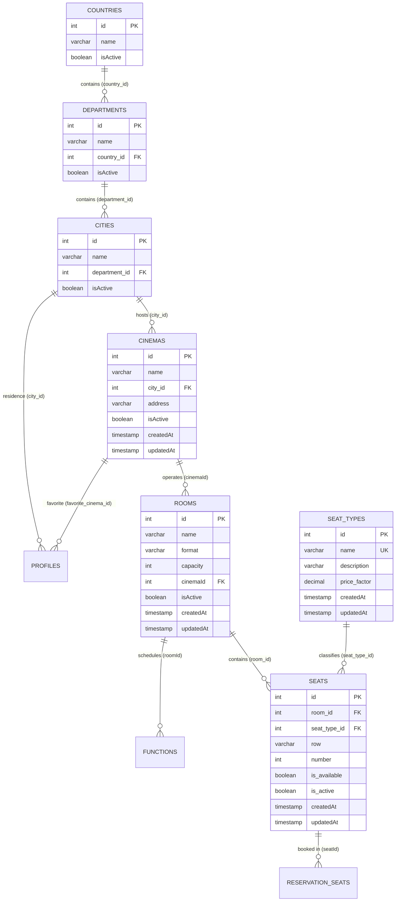

# Análisis de Modelos Sequelize - Grupo 2: Ubicaciones, Cines, Salas y Sillas

**Repositorio de origen:** [riwi-cine-backend-1](https://github.com/manulzweb/riwi-cine-backend-1)  
**Ruta en repo:** `app/src/models/`  
**Grupo:** Grupo 2 (Locations & Cinemas)  
**Entorno de Destino:** NestJS + TypeORM + PostgreSQL  
**Fecha:** 2026-10-05  

---

## 1. Resumen Ejecutivo del Grupo 2

El Grupo 2 comprende los 7 modelos fundamentales que gestionan la jerarquía geográfica, la infraestructura física de exhibición y la distribución de salas y silletería de la cadena MultiCine:
1. **Jerarquía Geográfica / Ubicaciones:**
   - `Country` (`countries`): Catálogo de países de operación.
   - `Department` (`departments`): División departamental / estatal vinculada a un país.
   - `City` (`cities`): Ciudades de cobertura donde operan los complejos de cine.
2. **Infraestructura de Complejos y Salas:**
   - `Cinema` (`cinemas`): Complejos físicos de exhibición (multiplexes).
   - `Room` (`rooms`): Salas de proyección pertenecientes a un cine (formato y capacidad).
3. **Distribución y Tipificación de Silletería:**
   - `SeatType` (`seat_types`): Catálogo de categorías de asientos con su factor multiplicador de precio (`price_factor`).
   - `Seat` (`seats`): Asientos físicos individuales distribuidos por fila y número dentro de cada sala.

---

### Hallazgos Críticos Transversales

1. **Grave Inconsistencia en Casing de Columnas en Base de Datos (CamelCase vs Snake_case):**
   - **`Room.cinemaId`:** En `room.model.ts`, la columna foránea NO define `field: 'cinema_id'`. En consecuencia, Sequelize crea la columna en base de datos literalmente como `"cinemaId"` (CamelCase entrecomillado en PostgreSQL).
   - **Columnas de Clave Foránea con `field` explícito:** `Department` usa `field: 'country_id'`, `City` usa `field: 'department_id'`, `Cinema` usa `field: 'city_id'`, `Seat` usa `field: 'room_id'` y `field: 'seat_type_id'`.
   - **Columna `isActive` vs `is_active`:** En `Country`, `Department`, `City`, `Cinema` y `Room`, la columna de estado se define como `isActive` sin la opción `field: 'is_active'`, por lo que se persiste como `"isActive"`. En marcado contraste, `Seat` define explícitamente `field: 'is_active'` y `field: 'is_available'`.
   - **Columna `priceFactor`:** `SeatType` define explícitamente `field: 'price_factor'`.
   - **Timestamps:** En todos los modelos con `timestamps: true` (`cinemas`, `rooms`, `seat_types`, `seats`), las columnas de auditoría son `"createdAt"` y `"updatedAt"` (CamelCase), dado que ninguno de estos modelos activa `underscored: true`.

2. **Omisión Crítica de Restricciones de Unicidad Compuesta (Data Integrity Risks):**
   - **`Seat`:** No cuenta con un índice o restricción única compuesta sobre `(room_id, row, number)`. En la base de datos legacy es técnicamente posible registrar asientos duplicados (misma fila y número) en la misma sala.
   - **`Room`:** No posee restricción de unicidad sobre `(cinemaId, name)`. Dos salas en el mismo cine podrían llamarse "Sala 1".
   - **`City` y `Department`:** No cuentan con unicidad sobre `(department_id, name)` o `(country_id, name)`.
   - **`Country`:** No cuenta con restricción `UNIQUE` en `name` a nivel de modelo.

3. **Confusión Arquitectónica en el Estado del Asiento (`Seat.is_available` vs Reservas Dinámicas):**
   - `Seat` posee dos flags booleanos estáticos: `is_active` e `is_available`.
   - La disponibilidad real de un asiento para el usuario no es una propiedad estática del asiento físico, sino una condición dinámica dependiente de la función/horario (`CinemaFunction`), controlada mediante `reservation_seats` y bloqueos temporales en memoria / SSE (HU-003, `plan-mejoras-arquitectura.md`).
   - Mantener `is_available` a nivel físico genera confusión con `is_active` (operatividad/mantenimiento del asiento físico).

4. **Clave Foránea Opcional en `Cinema` (`cityId` Nullable):**
   - En `cinema.model.ts`, `cityId` está configurado con `allowNull: true`. En el dominio de negocio, un cine físico no puede existir sin estar asignado a una ciudad válida.

5. **Dispersión en la Definición de Asociaciones:**
   - La relación `Cinema.hasMany(Room)` y `Room.belongsTo(Cinema)` está declarada únicamente dentro de `app/src/models/room.model.ts` y fue omitida en `app/src/models/index.ts`.
   - El alias de la relación de `Cinema` con `City` en `index.ts` fue nombrado `as: 'cityRef'` en lugar del estándar `as: 'city'`.
   - La relación de `CinemaFunction` hacia `Room` usa el alias `as: 'roomRelation'`, mientras que la inversa usa `as: 'functions'`.

6. **Divergencia en Auditoría de Timestamps:**
   - Los modelos de ubicación (`Country`, `Department`, `City`) tienen `timestamps: false`.
   - Los modelos de salas y cines (`Cinema`, `Room`, `SeatType`, `Seat`) tienen `timestamps: true`.
   - Ningún modelo del Grupo 2 implementa borrado lógico nativo (`paranoid: false`), confiando exclusivamente en flags booleanos de activación.

---

## 2. Diagrama Entidad-Relación (Mermaid)



---

## 3. Inventario Detallado de Modelos

---

### 3.1 Modelo: `Country`

- **Nombre del Modelo:** `Country`
- **Nombre Real de la Tabla (`tableName`):** `countries`
- **Archivo Origen:** `app/src/models/country.model.ts`
- **Opciones de Sequelize:**
  - `timestamps: false`
  - `underscored: false` (default)
  - `paranoid: false` (sin `deletedAt`)

#### Columnas y Atributos
| Nombre DB | Propiedad TS | Tipo Sequelize | Tipo SQL PostgreSQL | PK | Auto Inc | Allow Null | Default Value | Unique | Notas / Propósito |
|---|---|---|---|---|---|---|---|---|---|
| `id` | `id` | `INTEGER` | `INTEGER` | **Sí** | **Sí** | `false` | *None* | **Sí** | Clave primaria autoincremental |
| `name` | `name` | `STRING(100)` | `VARCHAR(100)` | No | No | `false` | *None* | No | Nombre del país (ej. "Colombia") |
| `isActive` | `isActive` | `BOOLEAN` | `BOOLEAN` | No | No | `false` | `true` | No | Flag de disponibilidad (columna CamelCase) |

#### Claves Foráneas y Restricciones
- Sin claves foráneas salientes.

#### Índices
- `PRIMARY KEY (id)`.
- Sin índices secundarios explícitos. Falta índice `UNIQUE` en `name`.

#### Asociaciones (según `models/index.ts`)
- `Country.hasMany(Department, { foreignKey: 'country_id', as: 'departments' })`
- `Department.belongsTo(Country, { foreignKey: 'country_id', as: 'country' })`

#### Discrepancias vs Plan de Migración y Recomendaciones TypeORM
- En TypeORM, mapear la columna `isActive` explícitamente como `@Column({ name: 'isActive', type: 'boolean', default: true })` para mantener retrocompatibilidad con la tabla existente sin forzar migraciones destructivas.
- Agregar un índice `UNIQUE` sobre `name` en el esquema de la base de datos para evitar registros duplicados durante la ejecución de seeders.

---

### 3.2 Modelo: `Department`

- **Nombre del Modelo:** `Department`
- **Nombre Real de la Tabla (`tableName`):** `departments`
- **Archivo Origen:** `app/src/models/department.model.ts`
- **Opciones de Sequelize:**
  - `timestamps: false`
  - `underscored: false` (default)
  - `paranoid: false`

#### Columnas y Atributos
| Nombre DB | Propiedad TS | Tipo Sequelize | Tipo SQL PostgreSQL | PK | Auto Inc | Allow Null | Default Value | Unique | Notas / Propósito |
|---|---|---|---|---|---|---|---|---|---|
| `id` | `id` | `INTEGER` | `INTEGER` | **Sí** | **Sí** | `false` | *None* | **Sí** | Clave primaria |
| `name` | `name` | `STRING(100)` | `VARCHAR(100)` | No | No | `false` | *None* | No | Nombre del departamento (ej. "Antioquia") |
| `country_id` | `countryId` | `INTEGER` | `INTEGER` | No | No | `false` | *None* | No | FK hacia `countries.id` (`field: 'country_id'`) |
| `isActive` | `isActive` | `BOOLEAN` | `BOOLEAN` | No | No | `false` | `true` | No | Estado activo (columna CamelCase) |

#### Claves Foráneas y Restricciones
- `country_id`: Clave foránea que referencia a `countries(id)`. Nota: en la definición del modelo no tiene bloque `references`, pero se vincula a través de `models/index.ts`.

#### Índices
- `PRIMARY KEY (id)`.
- Recomendado agregar índice compuesto único `UNIQUE (country_id, name)` para evitar duplicidad de departamentos por país.

#### Asociaciones (según `models/index.ts`)
- `Department.belongsTo(Country, { foreignKey: 'country_id', as: 'country' })`
- `Country.hasMany(Department, { foreignKey: 'country_id', as: 'departments' })`
- `Department.hasMany(City, { foreignKey: 'department_id', as: 'cities' })`
- `City.belongsTo(Department, { foreignKey: 'department_id', as: 'department' })`

#### Discrepancias vs Plan de Migración y Recomendaciones TypeORM
- Mapeo exacto: `@Column({ name: 'country_id' }) countryId: number;` y `@Column({ name: 'isActive', default: true }) isActive: boolean;`.
- Relación TypeORM `@ManyToOne(() => Country, country => country.departments) @JoinColumn({ name: 'country_id' })`.

---

### 3.3 Modelo: `City`

- **Nombre del Modelo:** `City`
- **Nombre Real de la Tabla (`tableName`):** `cities`
- **Archivo Origen:** `app/src/models/city.model.ts`
- **Opciones de Sequelize:**
  - `timestamps: false`
  - `underscored: false` (default)
  - `paranoid: false`

#### Columnas y Atributos
| Nombre DB | Propiedad TS | Tipo Sequelize | Tipo SQL PostgreSQL | PK | Auto Inc | Allow Null | Default Value | Unique | Notas / Propósito |
|---|---|---|---|---|---|---|---|---|---|
| `id` | `id` | `INTEGER` | `INTEGER` | **Sí** | **Sí** | `false` | *None* | **Sí** | Clave primaria |
| `name` | `name` | `STRING(100)` | `VARCHAR(100)` | No | No | `false` | *None* | No | Nombre de la ciudad (ej. "Medellín") |
| `department_id` | `departmentId` | `INTEGER` | `INTEGER` | No | No | `false` | *None* | No | FK a `departments.id` (`field: 'department_id'`) |
| `isActive` | `isActive` | `BOOLEAN` | `BOOLEAN` | No | No | `false` | `true` | No | Estado activo (columna CamelCase) |

#### Claves Foráneas y Restricciones
- `department_id`: Clave foránea que referencia a `departments(id)`.

#### Índices
- `PRIMARY KEY (id)`.
- Falta índice compuesto `UNIQUE (department_id, name)`.

#### Asociaciones (según `models/index.ts`)
- `City.belongsTo(Department, { foreignKey: 'department_id', as: 'department' })`
- `Department.hasMany(City, { foreignKey: 'department_id', as: 'cities' })`
- `City.hasMany(Cinema, { foreignKey: 'city_id', as: 'cinemas' })`
- `Cinema.belongsTo(City, { foreignKey: 'city_id', as: 'cityRef' })` *(alias irregular)*
- `City.hasMany(Profile, { foreignKey: 'city_id', as: 'profiles' })`
- `Profile.belongsTo(City, { foreignKey: 'city_id', as: 'city' })`

#### Discrepancias vs Plan de Migración y Recomendaciones TypeORM
- Normalizar el alias en TypeORM a `city` (en lugar de `cityRef`) para mayor consistencia con las convenciones NestJS.
- La entidad `Profile` del Grupo 1 mantiene una relación foránea directa con `City` (`city_id`) para segmentación de usuarios por residencia.

---

### 3.4 Modelo: `Cinema`

- **Nombre del Modelo:** `Cinema`
- **Nombre Real de la Tabla (`tableName`):** `cinemas`
- **Archivo Origen:** `app/src/models/cinema.model.ts`
- **Opciones de Sequelize:**
  - `timestamps: true` (genera `createdAt` y `updatedAt` en CamelCase)
  - `underscored: false`
  - `paranoid: false`

#### Columnas y Atributos
| Nombre DB | Propiedad TS | Tipo Sequelize | Tipo SQL PostgreSQL | PK | Auto Inc | Allow Null | Default Value | Unique | Notas / Propósito |
|---|---|---|---|---|---|---|---|---|---|
| `id` | `id` | `INTEGER` | `INTEGER` | **Sí** | **Sí** | `false` | *None* | **Sí** | Clave primaria |
| `name` | `name` | `STRING(200)` | `VARCHAR(200)` | No | No | `false` | *None* | No | Nombre comercial (ej. "MultiCine El Tesoro") |
| `city_id` | `cityId` | `INTEGER` | `INTEGER` | No | No | **`true`** | *None* | No | FK a `cities.id` (**anomalía: nullable**) |
| `address` | `address` | `STRING(300)` | `VARCHAR(300)` | No | No | `false` | *None* | No | Dirección física completa |
| `isActive` | `isActive` | `BOOLEAN` | `BOOLEAN` | No | No | `false` | `true` | No | Estado operativo (columna CamelCase) |
| `createdAt` | `createdAt` | `DATE` | `TIMESTAMPTZ` | No | No | `false` | `now()` | No | Timestamp de auditoría (CamelCase) |
| `updatedAt` | `updatedAt` | `DATE` | `TIMESTAMPTZ` | No | No | `false` | `now()` | No | Timestamp de auditoría (CamelCase) |

#### Claves Foráneas y Restricciones
- `city_id`: Referencia a `cities(id)` con bloque inline `references: { model: City, key: 'id' }`. Sin embargo, tiene `allowNull: true`, lo cual contradice la lógica de negocio.

#### Índices
- `PRIMARY KEY (id)`.
- Se requiere índice sobre `city_id` para optimizar consultas de cartelera por ciudad (`GET /api/v1/movies/weekly?cityId=1` según HU-003).

#### Asociaciones
- En `room.model.ts`:
  - `Cinema.hasMany(Room, { foreignKey: 'cinemaId', as: 'rooms' })`
- En `models/index.ts`:
  - `Cinema.belongsTo(City, { foreignKey: 'city_id', as: 'cityRef' })`
  - `City.hasMany(Cinema, { foreignKey: 'city_id', as: 'cinemas' })`
  - `Cinema.hasMany(Profile, { foreignKey: 'favorite_cinema_id', as: 'profiles' })`
  - `Profile.belongsTo(Cinema, { foreignKey: 'favorite_cinema_id', as: 'favoriteCinema' })`

#### Discrepancias vs Plan de Migración y Recomendaciones TypeORM
1. **Obligatoriedad de `city_id`:** En TypeORM, `cityId` debe definirse como no nulo (`nullable: false`). Si en la base de datos existen cines con `city_id = NULL`, deberán sanearse con una migración previa antes de aplicar la restricción.
2. **Timestamps en CamelCase:** Mapear explícitamente `@CreateDateColumn({ name: 'createdAt' })` y `@UpdateDateColumn({ name: 'updatedAt' })`.
3. **Cine Favorito en Perfiles:** La tabla `profiles` se asocia con `cinemas` mediante `favorite_cinema_id`, permitiendo personalizar la experiencia de cartelera del cliente (HU-008).

---

### 3.5 Modelo: `Room`

- **Nombre del Modelo:** `Room`
- **Nombre Real de la Tabla (`tableName`):** `rooms`
- **Archivo Origen:** `app/src/models/room.model.ts`
- **Opciones de Sequelize:**
  - `timestamps: true` (genera `createdAt` y `updatedAt` en CamelCase)
  - `underscored: false`
  - `paranoid: false`

#### Columnas y Atributos
| Nombre DB | Propiedad TS | Tipo Sequelize | Tipo SQL PostgreSQL | PK | Auto Inc | Allow Null | Default Value | Unique | Notas / Propósito |
|---|---|---|---|---|---|---|---|---|---|
| `id` | `id` | `INTEGER` | `INTEGER` | **Sí** | **Sí** | `false` | *None* | **Sí** | Clave primaria |
| `name` | `name` | `STRING(100)` | `VARCHAR(100)` | No | No | `false` | *None* | No | Nombre de la sala (ej. "Sala 1 IMAX") |
| `format` | `format` | `STRING(20)` | `VARCHAR(20)` | No | No | `false` | *None* | No | Formato: "2D", "3D", "IMAX", "VIP" |
| `capacity` | `capacity` | `INTEGER` | `INTEGER` | No | No | `false` | *None* | No | Aforo total calculado |
| `cinemaId` | `cinemaId` | `INTEGER` | `INTEGER` | No | No | `false` | *None* | No | **CRÍTICO: Columna CamelCase en DB** (`"cinemaId"`) |
| `isActive` | `isActive` | `BOOLEAN` | `BOOLEAN` | No | No | `false` | `true` | No | Estado de sala (CamelCase) |
| `createdAt` | `createdAt` | `DATE` | `TIMESTAMPTZ` | No | No | `false` | `now()` | No | Timestamp de creación (CamelCase) |
| `updatedAt` | `updatedAt` | `DATE` | `TIMESTAMPTZ` | No | No | `false` | `now()` | No | Timestamp de actualización (CamelCase) |

#### Claves Foráneas y Restricciones
- `cinemaId`: Clave foránea que referencia a `cinemas(id)`. **Atención:** la columna en base de datos NO se llama `cinema_id`, sino `cinemaId`.
- No existe restricción `CHECK` sobre `format`.

#### Índices
- `PRIMARY KEY (id)`.
- Falta índice `UNIQUE (cinemaId, name)`.
- Índice en `cinemaId` recomendado para filtrado rápido de salas por multiplex.

#### Asociaciones
- En `room.model.ts`:
  - `Room.belongsTo(Cinema, { foreignKey: 'cinemaId', as: 'cinema' })`
  - `Cinema.hasMany(Room, { foreignKey: 'cinemaId', as: 'rooms' })`
- En `models/index.ts`:
  - `Room.hasMany(Seat, { foreignKey: 'roomId', as: 'seats' })`
  - `Seat.belongsTo(Room, { foreignKey: 'roomId', as: 'room' })`
  - `Room.hasMany(CinemaFunction, { foreignKey: 'roomId', as: 'functions' })`
  - `CinemaFunction.belongsTo(Room, { foreignKey: 'roomId', as: 'roomRelation' })`

#### Discrepancias vs Plan de Migración y Recomendaciones TypeORM
1. **Trampa de Naming en Columna FK:**
   - En TypeORM, se DEBE declarar:
     ```typescript
     @ManyToOne(() => Cinema, cinema => cinema.rooms)
     @JoinColumn({ name: 'cinemaId' }) // ¡Exactamente cinemaId, no cinema_id!
     cinema: Cinema;

     @Column({ name: 'cinemaId' })
     cinemaId: number;
     ```
   - Si se usa una estrategia global `snake_case`, TypeORM buscará `cinema_id` y provocará fallos en ejecución (`column "rooms.cinema_id" does not exist`).
2. **Redundancia en `functions` (`CinemaFunction`):**
   - El modelo `CinemaFunction` (`functions`) almacena simultáneamente `roomId` (FK), `room` (string denormalizado con el nombre de la sala) y `format` (string). En la nueva arquitectura NestJS, el nombre y formato de la sala deben consultarse mediante la relación `Room` en lugar de duplicarse en cada función.
3. **Formato Tipado:** En NestJS, tipar `format` con un Enum TypeScript (`RoomFormat: '2D' | '3D' | 'IMAX' | 'VIP'`).

---

### 3.6 Modelo: `SeatType`

- **Nombre del Modelo:** `SeatType`
- **Nombre Real de la Tabla (`tableName`):** `seat_types`
- **Archivo Origen:** `app/src/models/seat-type.model.ts`
- **Opciones de Sequelize:**
  - `timestamps: true` (genera `createdAt` y `updatedAt` en CamelCase)
  - `underscored: false`
  - `paranoid: false`

#### Columnas y Atributos
| Nombre DB | Propiedad TS | Tipo Sequelize | Tipo SQL PostgreSQL | PK | Auto Inc | Allow Null | Default Value | Unique | Notas / Propósito |
|---|---|---|---|---|---|---|---|---|---|
| `id` | `id` | `INTEGER` | `INTEGER` | **Sí** | **Sí** | `false` | *None* | **Sí** | Clave primaria |
| `name` | `name` | `STRING(50)` | `VARCHAR(50)` | No | No | `false` | *None* | **Sí** | Categoría: "General", "Preferencial", "VIP" |
| `description` | `description` | `STRING(255)` | `VARCHAR(255)` | No | No | `true` | *None* | No | Descripción de beneficios del asiento |
| `price_factor` | `priceFactor` | `DECIMAL(10, 2)` | `NUMERIC(10, 2)` | No | No | `false` | `1.00` | No | Multiplicador de tarifa (`field: 'price_factor'`) |
| `createdAt` | `createdAt` | `DATE` | `TIMESTAMPTZ` | No | No | `false` | `now()` | No | Timestamp de auditoría (CamelCase) |
| `updatedAt` | `updatedAt` | `DATE` | `TIMESTAMPTZ` | No | No | `false` | `now()` | No | Timestamp de auditoría (CamelCase) |

#### Claves Foráneas y Restricciones
- Sin claves foráneas salientes.
- Restricción `UNIQUE` en `name`.

#### Índices
- `PRIMARY KEY (id)`.
- `UNIQUE INDEX` en `name`.

#### Asociaciones (según `models/index.ts`)
- `SeatType.hasMany(Seat, { foreignKey: 'seatTypeId', as: 'seats' })`
- `Seat.belongsTo(SeatType, { foreignKey: 'seatTypeId', as: 'seatType' })`

#### Discrepancias vs Plan de Migración y Recomendaciones TypeORM
- Mapeo TypeORM:
  ```typescript
  @Column({ name: 'price_factor', type: 'decimal', precision: 10, scale: 2, default: 1.0 })
  priceFactor: number;
  ```
- **Cálculo de Tarifas de Asientos:** El valor final de un boleto se liquida multiplicando el precio base de la función (`functions.price`) por `seat_types.price_factor` (ej: General = 1.0, Preferencial = 1.3, VIP = 1.8). En NestJS, este cálculo debe encapsularse en un Domain Service de Pricing con soporte de redondeo estricto para evitar pérdidas de centavos.

---

### 3.7 Modelo: `Seat`

- **Nombre del Modelo:** `Seat`
- **Nombre Real de la Tabla (`tableName`):** `seats`
- **Archivo Origen:** `app/src/models/seat.model.ts`
- **Opciones de Sequelize:**
  - `timestamps: true` (genera `createdAt` y `updatedAt` en CamelCase)
  - `underscored: false`
  - `paranoid: false`

#### Columnas y Atributos
| Nombre DB | Propiedad TS | Tipo Sequelize | Tipo SQL PostgreSQL | PK | Auto Inc | Allow Null | Default Value | Unique | Notas / Propósito |
|---|---|---|---|---|---|---|---|---|---|
| `id` | `id` | `INTEGER` | `INTEGER` | **Sí** | **Sí** | `false` | *None* | **Sí** | Clave primaria |
| `room_id` | `roomId` | `INTEGER` | `INTEGER` | No | No | `false` | *None* | No | FK hacia `rooms.id` (`field: 'room_id'`) |
| `seat_type_id` | `seatTypeId` | `INTEGER` | `INTEGER` | No | No | `false` | *None* | No | FK hacia `seat_types.id` (`field: 'seat_type_id'`) |
| `row` | `row` | `STRING(10)` | `VARCHAR(10)` | No | No | `false` | *None* | No | Fila física (ej. "A", "B", "C") |
| `number` | `number` | `INTEGER` | `INTEGER` | No | No | `false` | *None* | No | Número correlativo de asiento en fila |
| `is_available` | `isAvailable` | `BOOLEAN` | `BOOLEAN` | No | No | `false` | `true` | No | Flag de disponibilidad física (`field: 'is_available'`) |
| `is_active` | `isActive` | `BOOLEAN` | `BOOLEAN` | No | No | `false` | `true` | No | Flag de estado operativo (`field: 'is_active'`) |
| `createdAt` | `createdAt` | `DATE` | `TIMESTAMPTZ` | No | No | `false` | `now()` | No | Timestamp de auditoría (CamelCase) |
| `updatedAt` | `updatedAt` | `DATE` | `TIMESTAMPTZ` | No | No | `false` | `now()` | No | Timestamp de auditoría (CamelCase) |

#### Claves Foráneas y Restricciones
- `room_id`: Referencia a `rooms(id)`.
- `seat_type_id`: Referencia a `seat_types(id)`.
- **Falta restricción crítica:** No hay restricción única compuesta sobre `(room_id, row, number)`.

#### Índices
- `PRIMARY KEY (id)`.
- **Índice Compuesto Mandatorio para Migración:**
  ```sql
  CREATE UNIQUE INDEX uq_seat_room_row_number ON seats (room_id, row, number);
  ```

#### Asociaciones (según `models/index.ts`)
- `Seat.belongsTo(Room, { foreignKey: 'roomId', as: 'room' })`
- `Room.hasMany(Seat, { foreignKey: 'roomId', as: 'seats' })`
- `Seat.belongsTo(SeatType, { foreignKey: 'seatTypeId', as: 'seatType' })`
- `SeatType.hasMany(Seat, { foreignKey: 'seatTypeId', as: 'seats' })`
- `Seat.hasMany(ReservationSeat, { foreignKey: 'seatId', as: 'reservationSeats' })`
- `ReservationSeat.belongsTo(Seat, { foreignKey: 'seatId', as: 'seat' })`

#### Discrepancias vs Plan de Migración y Recomendaciones TypeORM
1. **Doble Columna Booleana (`is_available` vs `is_active`):**
   - En la base de datos legacy, `Seat` tiene tanto `is_available` como `is_active`.
   - En NestJS + TypeORM:
     - `is_active`: Determina si el asiento físico está habilitado para la venta o en mantenimiento físico (ej: silla rota).
     - `is_available`: No debe ser usado para controlar reservas de funciones. La disponibilidad de una función se consulta en tiempo real mediante `LEFT JOIN reservation_seats ON reservation_seats.seat_id = seat.id AND reservation_seats.function_id = :functionId AND reservation_seats.status IN ('LOCKED', 'SOLD')`.
2. **Asociación en Sequelize `foreignKey: 'roomId'`:**
   - En Sequelize `index.ts`, la asociación utiliza `foreignKey: 'roomId'`, pero en el modelo `Seat` la columna está mapeada a `field: 'room_id'`. En TypeORM debe fijarse sin ambigüedades:
     ```typescript
     @ManyToOne(() => Room, room => room.seats)
     @JoinColumn({ name: 'room_id' })
     room: Room;

     @Column({ name: 'room_id' })
     roomId: number;
     ```

---

## 4. Matriz Comparativa: Sequelize Actual vs Propuesta TypeORM

| Modelo Sequelize | Tabla BD Actual | Entidad TypeORM Propuesta | Casing Columnas BD | Timestamps | Soft Delete | Módulo NestJS | Riesgo / Transformación Requerida |
|---|---|---|---|---|---|---|---|
| `Country` | `countries` | `Country` | Mixto (`isActive` en camelCase) | **NO** | No | `locations` | Mapear `@Column({ name: 'isActive' })`. Sin timestamps automáticos. |
| `Department` | `departments` | `Department` | Mixto (`country_id`, `isActive`) | **NO** | No | `locations` | Mapear `@Column({ name: 'country_id' })` y `@Column({ name: 'isActive' })`. |
| `City` | `cities` | `City` | Mixto (`department_id`, `isActive`) | **NO** | No | `locations` | Estandarizar alias a `city` (reemplazar `cityRef`). |
| `Cinema` | `cinemas` | `Cinema` | Mixto (`city_id`, `isActive`, `createdAt`, `updatedAt`) | `createdAt`, `updatedAt` | No | `cinemas` | Corregir `city_id` a no nulo en TypeORM; indexar `city_id` para HU-003. |
| `Room` | `rooms` | `Room` | **CamelCase Crítico** (`"cinemaId"`, `"isActive"`, `"createdAt"`, `"updatedAt"`) | `createdAt`, `updatedAt` | No | `cinemas` | **ALTO RIESGO:** La columna foránea en BD es literalmente `"cinemaId"`. `@JoinColumn({ name: 'cinemaId' })`. |
| `SeatType` | `seat_types` | `SeatType` | Mixto (`price_factor`, `createdAt`, `updatedAt`) | `createdAt`, `updatedAt` | No | `cinemas` | Mapear `price_factor` como `DECIMAL(10,2)`; preservar índice único en `name`. |
| `Seat` | `seats` | `Seat` | Mixto (`room_id`, `seat_type_id`, `is_available`, `is_active`, `createdAt`, `updatedAt`) | `createdAt`, `updatedAt` | No | `cinemas` | Crear índice compuesto `UNIQUE (room_id, row, number)`. Desacoplar `is_available` del flujo de reservas de showtimes. |

---

## 5. Recomendaciones Arquitectónicas para el Entregable `docs/database-inventory.md`

1. **Estrategia Estricta de Nombres de Columnas en TypeORM:**
   - No es viable utilizar `SnakeNamingStrategy` de TypeORM de forma global sin excepciones manuales, porque rompería la consulta de `Room` (donde la columna es `cinemaId` en lugar de `cinema_id`) y de todos los campos `isActive`, `createdAt` y `updatedAt` presentes en el Grupo 2.
   - Cada entidad TypeORM debe explicitar los nombres reales de columna mediante `@Column({ name: '...' })` y `@JoinColumn({ name: '...' })`.

2. **Migración de Integridad Referencial y Restricciones Faltantes (Fase 1 / Migraciones SQL):**
   - Incluir en la primera migración de TypeORM:
     ```sql
     -- 1. Unicidad de asiento por sala
     ALTER TABLE seats 
       ADD CONSTRAINT uq_seats_room_row_number UNIQUE (room_id, "row", number);

     -- 2. Unicidad de nombre de sala por cine
     ALTER TABLE rooms 
       ADD CONSTRAINT uq_rooms_cinema_name UNIQUE ("cinemaId", name);

     -- 3. Unicidad de ciudad por departamento
     ALTER TABLE cities 
       ADD CONSTRAINT uq_cities_department_name UNIQUE (department_id, name);

     -- 4. Unicidad de departamento por país
     ALTER TABLE departments 
       ADD CONSTRAINT uq_departments_country_name UNIQUE (country_id, name);

     -- 5. No nulidad obligatoria de city_id en cines
     ALTER TABLE cinemas 
       ALTER COLUMN city_id SET NOT NULL;
     ```

3. **Arquitectura de Silletería en Tiempo Real (Alineación con Plan de Mejoras y HU-003):**
   - El estado de ocupación de las sillas debe consultar el estado de reserva en memoria / caché Redis o mediante `reservation_seats` con bloqueo pesimista `SELECT ... FOR UPDATE` durante el proceso de Checkout.
   - `Seat.is_active` debe restringirse exclusivamente al estado de mantenimiento operativo de la silla física.

4. **Seeding Idempotente:**
   - El seeder de `seed-cine.json` (probado en `SeedService`) genera la distribución completa de 4 filas (A, B de tipo General, C de tipo Preferencial, D de tipo VIP) con 6 asientos cada una por sala (24 asientos por sala). Esta lógica debe transponerse a un comando o seeder TypeORM en NestJS preservando la idempotencia mediante `findOrCreate` o `INSERT ... ON CONFLICT DO NOTHING`.
