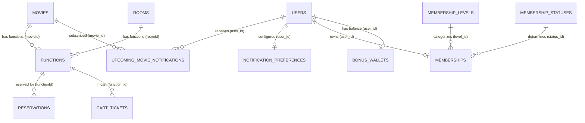

# Análisis de Modelos Sequelize - Grupo 3: Películas, Funciones, Fidelización y Notificaciones

**Repositorio de origen:** [riwi-cine-backend-1](https://github.com/manulzweb/riwi-cine-backend-1)  
**Ruta en repo:** `app/src/models/`  
**Grupo:** Grupo 3 (Movies, Showtimes, Loyalty & Notifications)  
**Fecha:** 2026-10-05  

---

## 1. Resumen Ejecutivo del Grupo 3

El Grupo 3 comprende 8 modelos Sequelize fundamentales que abarcan tres capacidades de negocio clave:
1. **Catálogo de Cine & Funciones:** `Movie` (`movies`) y `CinemaFunction` (`functions`).
2. **Notificaciones y Preferencias:** `NotificationPreference` (`notification_preferences`) y `UpcomingMovieNotification` (`upcoming_movie_notifications`).
3. **Programa de Fidelización (Loyalty):** `Membership` (`memberships`), `MembershipLevel` (`membership_levels`), `MembershipStatus` (`membership_statuses`) y `BonusWallet` (`bonus_wallets`).

### Hallazgos Críticos Transversales:
- **Disparidad de Naming Convention (CamelCase vs Snake_case):**
  - Modelos como `Movie` y `CinemaFunction` se definieron con `underscored: false` (o sin especificar, default `false`), generando columnas camelCase en base de datos (`releaseDate`, `posterUrl`, `averageRating`, `movieId`, `roomId`, etc.).
  - Por el contrario, los modelos de Notificaciones y Membresías (`NotificationPreference`, `UpcomingMovieNotification`, `MembershipLevel`, `MembershipStatus`, `Membership`, `BonusWallet`) especifican explícitamente `underscored: true` y mapeos de `field` a `snake_case` (`user_id`, `created_at`, `movie_id`, `points_balance`, etc.).
- **Columnas Redundantes por Compatibilidad en `Movie` y `CinemaFunction`:**
  - Existen duplicidades originadas por el merge entre la rama `develop` y ramas de features (ej. `genres` [array] vs `genre` [string], `active` vs `isActive`, `roomId` [FK] vs `room` [string]).
- **Tipos de Datos Específicos de PostgreSQL:**
  - `Movie` utiliza `DataTypes.ARRAY(DataTypes.STRING)` para `actors`, `genres`, `languages` y `formats`.
- **Manejo de Moneda y Precios:**
  - `CinemaFunction` utiliza `DataTypes.FLOAT` para `price`, lo cual representa un riesgo de precisión en operaciones financieras comparado con `DECIMAL(10,2)`.
- **Ausencia de Soft Delete Nativo:**
  - Ningún modelo tiene `paranoid: true` ni columna `deletedAt`. Se utilizan banderas booleanas (`active`, `isActive`).
- **Tablas de Catálogo sin Timestamps:**
  - `MembershipLevel` y `MembershipStatus` tienen `timestamps: false`.

---

## 2. Inventario Detallado de Modelos

---

### 2.1 Modelo: `Movie`

- **Nombre del Modelo:** `Movie`
- **Nombre Real de la Tabla (`tableName`):** `movies`
- **Archivo Origen:** `app/src/models/movie.model.ts`
- **Opciones de Sequelize:**
  - `timestamps: true` (genera `createdAt` y `updatedAt`)
  - `underscored: false` (nombres de columnas por defecto en CamelCase)
  - `paranoid: false` (sin soft delete / `deletedAt`)

#### Columnas y Atributos:
| Nombre DB | Propiedad TS | Tipo de Dato Sequelize | Tipo SQL PostgreSQL | PK | Auto Inc | Allow Null | Default Value | Unique | Notas / Propósito |
|---|---|---|---|---|---|---|---|---|---|
| `id` | `id` | `INTEGER` | `INTEGER` | **Sí** | **Sí** | `false` | *None* | **Sí** | Identificador único de película |
| `title` | `title` | `STRING(200)` | `VARCHAR(200)` | No | No | `false` | *None* | No | Título comercial |
| `synopsis` | `synopsis` | `TEXT` | `TEXT` | No | No | `false` | *None* | No | Sinopsis completa (HU-004) |
| `director` | `director` | `STRING(150)` | `VARCHAR(150)` | No | No | `false` | *None* | No | Director(es) de la película |
| `actors` | `actors` | `ARRAY(STRING)` | `TEXT[]` / `VARCHAR[]` | No | No | `false` | `[]` | No | Lista de actores principales |
| `genres` | `genres` | `ARRAY(STRING)` | `TEXT[]` / `VARCHAR[]` | No | No | `false` | `[]` | No | Lista de géneros múltiples |
| `languages` | `languages` | `ARRAY(STRING)` | `TEXT[]` / `VARCHAR[]` | No | No | `false` | `[]` | No | Idiomas disponibles (Doblada/Sub) |
| `formats` | `formats` | `ARRAY(STRING)` | `TEXT[]` / `VARCHAR[]` | No | No | `false` | `[]` | No | Formatos (2D, 3D, IMAX, VIP) |
| `duration` | `duration` | `INTEGER` | `INTEGER` | No | No | `false` | *None* | No | Duración en minutos |
| `classification` | `classification` | `STRING(20)` | `VARCHAR(20)` | No | No | `false` | *None* | No | Clasificación por edad (ej. "PG-13") |
| `releaseDate` | `releaseDate` | `DATEONLY` | `DATE` | No | No | `false` | *None* | No | Fecha de estreno oficial |
| `posterUrl` | `posterUrl` | `STRING(500)` | `VARCHAR(500)` | No | No | `false` | *None* | No | URL del póster vertical |
| `bannerUrl` | `bannerUrl` | `STRING(500)` | `VARCHAR(500)` | No | No | `true` | *None* | No | URL del banner horizontal |
| `trailerUrl` | `trailerUrl` | `STRING(500)` | `VARCHAR(500)` | No | No | `true` | *None* | No | URL de tráiler (ej. YouTube) |
| `averageRating` | `averageRating` | `DECIMAL(2, 1)` | `NUMERIC(2, 1)` | No | No | `false` | `0` | No | Calificación promedio (0.0 a 5.0) |
| `active` | `active` | `BOOLEAN` | `BOOLEAN` | No | No | `false` | `true` | No | Estado en cartelera |
| `genre` | `genre` | `STRING(100)` | `VARCHAR(100)` | No | No | `true` | *None* | No | *Columna de compatibilidad develop* |
| `language` | `language` | `STRING(50)` | `VARCHAR(50)` | No | No | `true` | *None* | No | *Columna de compatibilidad develop* |
| `isSubtitled` | `isSubtitled` | `BOOLEAN` | `BOOLEAN` | No | No | `true` | *None* | No | *Columna de compatibilidad develop* |
| `rating` | `rating` | `FLOAT` | `DOUBLE PRECISION` | No | No | `true` | *None* | No | *Columna de compatibilidad develop* |
| `isActive` | `isActive` | `BOOLEAN` | `BOOLEAN` | No | No | `false` | `true` | No | *Columna de compatibilidad develop* |
| `createdAt` | `createdAt` | `DATE` | `TIMESTAMPTZ` | No | No | `false` | `now()` | No | Timestamp de creación |
| `updatedAt` | `updatedAt` | `DATE` | `TIMESTAMPTZ` | No | No | `false` | `now()` | No | Timestamp de actualización |

#### Claves Foráneas y Restricciones:
- Ninguna clave foránea saliente en `movies`.

#### Índices:
- `PRIMARY KEY (id)` (automático).
- Sin índices secundarios explícitos en la definición del modelo.

#### Asociaciones (según `models/index.ts`):
- `Movie.hasMany(CinemaFunction, { foreignKey: 'movieId', as: 'functions' })`
- `Movie.hasMany(UpcomingMovieNotification, { foreignKey: 'movie_id', as: 'upcomingMovieNotifications' })`

#### Discrepancias vs Plan de Migración y Recomendaciones TypeORM:
1. **Redundancia severa de campos legacy:** Existen dos formas para varios datos:
   - `genres` (array de strings) frente a `genre` (string único).
   - `languages` (array) frente a `language` (string) e `isSubtitled` (boolean).
   - `averageRating` (decimal(2,1)) frente a `rating` (float).
   - `active` (boolean) frente a `isActive` (boolean).
   *Recomendación:* La entidad TypeORM debe estandarizarse hacia los nombres canónicos del plan (`active`, `averageRating`, `genres`, `languages`, `formats`). Se requiere una migración de datos que sincronice los datos residuales de `genre`/`language` hacia los arrays antes de eliminar las columnas obsoletas.
2. **Columnas Postgres ARRAY:** TypeORM soporta `@Column('text', { array: true })` en PostgreSQL. Se debe mapear explícitamente.
3. **Casing en Base de Datos:** Las columnas están en CamelCase entre comillas en Postgres (`"releaseDate"`, `"posterUrl"`, `"bannerUrl"`, `"trailerUrl"`, `"averageRating"`, `"isSubtitled"`, `"isActive"`, `"createdAt"`, `"updatedAt"`). Si TypeORM asume convención snake_case global, fallarán las consultas a menos que se use `name: 'releaseDate'` en cada decorador `@Column()`.
4. **Soft Delete:** El plan menciona soft delete para catálogo. Actualmente `Movie` sólo usa `active: boolean`. Evaluar si en Fase 4 se agrega `deleted_at: timestamp` vía migración controlada.

---

### 2.2 Modelo: `CinemaFunction`

- **Nombre del Modelo:** `CinemaFunction`
- **Nombre Real de la Tabla (`tableName`):** `functions`
- **Archivo Origen:** `app/src/models/function.model.ts`
- **Opciones de Sequelize:**
  - `timestamps: true` (genera `createdAt` y `updatedAt`)
  - `underscored: false` (columnas camelCase por defecto)
  - `paranoid: false`

#### Columnas y Atributos:
| Nombre DB | Propiedad TS | Tipo de Dato Sequelize | Tipo SQL PostgreSQL | PK | Auto Inc | Allow Null | Default Value | Unique | Notas / Propósito |
|---|---|---|---|---|---|---|---|---|---|
| `id` | `id` | `INTEGER` | `INTEGER` | **Sí** | **Sí** | `false` | *None* | **Sí** | Identificador único de función/horario |
| `movieId` | `movieId` | `INTEGER` | `INTEGER` | No | No | `false` | *None* | No | FK a `movies.id` |
| `roomId` | `roomId` | `INTEGER` | `INTEGER` | No | No | `true` | *None* | No | FK a `rooms.id` (*permite null en tests viejos*) |
| `startTime` | `startTime` | `DATE` | `TIMESTAMPTZ` | No | No | `true` | *None* | No | Fecha y hora de inicio de la función |
| `endTime` | `endTime` | `DATE` | `TIMESTAMPTZ` | No | No | `true` | *None* | No | Fecha y hora estimada de finalización |
| `price` | `price` | `FLOAT` | `DOUBLE PRECISION` | No | No | `false` | *None* | No | Precio base del boleto |
| `availableSeats` | `availableSeats` | `INTEGER` | `INTEGER` | No | No | `false` | *None* | No | Contador de asientos libres disponibles |
| `isActive` | `isActive` | `BOOLEAN` | `BOOLEAN` | No | No | `false` | `true` | No | Bandera de función activa |
| `format` | `format` | `STRING(20)` | `VARCHAR(20)` | No | No | `true` | *None* | No | Formato de proyección (2D, 3D, IMAX) |
| `room` | `room` | `STRING(50)` | `VARCHAR(50)` | No | No | `true` | *None* | No | *Nombre de texto plano de la sala (legacy)* |
| `totalSeats` | `totalSeats` | `INTEGER` | `INTEGER` | No | No | `true` | *None* | No | Capacidad total de la sala en función |
| `active` | `active` | `BOOLEAN` | `BOOLEAN` | No | No | `false` | `true` | No | *Columna duplicada de estado* |
| `createdAt` | `createdAt` | `DATE` | `TIMESTAMPTZ` | No | No | `false` | `now()` | No | Timestamp de creación |
| `updatedAt` | `updatedAt` | `DATE` | `TIMESTAMPTZ` | No | No | `false` | `now()` | No | Timestamp de actualización |

#### Claves Foráneas y Restricciones:
- `movieId`: References `movies(id)`.
- `roomId`: References `rooms(id)` (asociado en `index.ts`, alias `roomRelation`).

#### Índices:
- `PRIMARY KEY (id)`.
- Sin índice compuesto en `(movieId, startTime)` ni `(roomId, startTime)` a nivel modelo.

#### Asociaciones (según `models/index.ts`):
- `CinemaFunction.belongsTo(Movie, { foreignKey: 'movieId', as: 'movie' })`
- `CinemaFunction.belongsTo(Room, { foreignKey: 'roomId', as: 'roomRelation' })`
- `CinemaFunction.hasMany(Reservation, { foreignKey: 'functionId', as: 'reservations' })`
- `CinemaFunction.hasMany(CartTicket, { foreignKey: 'function_id', as: 'cartTickets' })`

#### Discrepancias vs Plan de Migración y Recomendaciones TypeORM:
1. **Nombre de Tabla Reservado:** La tabla física se llama `functions`. En PostgreSQL, `function` es una palabra reservada del lenguaje SQL. Todas las consultas manuales o generadas requieren comillas dobles `"functions"`. En el plan NestJS, el feature se denomina `showtimes` y la entidad `CinemaFunction`, lo que mapea adecuadamente a `@Entity('functions')`.
2. **Campos Duplicados y Nulos Indeseados:**
   - `isActive` y `active` son columnas redundantes idénticas.
   - `room` (string) coexiste con `roomId` (relación a `rooms`).
   - `roomId`, `startTime` y `endTime` tienen `allowNull: true` en el código heredado por compatibilidad de tests viejos. En una arquitectura robusta de cine (HU-004, Cartelera y Reservas), una función sin sala física ni fecha/hora es inválida. En TypeORM se debe tipar como obligatorio en las nuevas inserciones y validar integridad referencial de filas existentes.
3. **Tipo de Dato de Precio:** `price` está como `FLOAT`. En TypeORM debe manejarse como `@Column('numeric', { precision: 10, scale: 2 })` o con transformer a número para evitar imprecisiones de coma flotante.
4. **Inconsistencia de Nombres de FK en Tablas Hijas:**
   - En `reservations`: la FK hacia esta tabla se llama `functionId` (CamelCase).
   - En `cart_tickets`: la FK hacia esta tabla se llama `function_id` (snake_case).
   - En `functions` misma: las FKs son `movieId` y `roomId` (CamelCase).
5. **Control de Concurrencia y Disponibilidad:** La columna `availableSeats` es un contador desnormalizado propenso a carreras si múltiples usuarios compran en paralelo. El plan de migración (Sección 9.3) especifica que la disponibilidad real y atómica debe basarse en la tabla `reservation_seats` con restricción única sobre `(function_id, seat_id)`.

---

### 2.3 Modelo: `NotificationPreference`

- **Nombre del Modelo:** `NotificationPreference`
- **Nombre Real de la Tabla (`tableName`):** `notification_preferences`
- **Archivo Origen:** `app/src/models/notification-preference.model.ts`
- **Opciones de Sequelize:**
  - `timestamps: true` (genera `created_at` y `updated_at`)
  - `underscored: true` (todas las columnas en `snake_case`)
  - `paranoid: false`

#### Columnas y Atributos:
| Nombre DB | Propiedad TS | Tipo de Dato Sequelize | Tipo SQL PostgreSQL | PK | Auto Inc | Allow Null | Default Value | Unique | Notas / Propósito |
|---|---|---|---|---|---|---|---|---|---|
| `id` | `id` | `INTEGER` | `INTEGER` | **Sí** | **Sí** | `false` | *None* | **Sí** | Identificador de preferencia |
| `user_id` | `userId` | `INTEGER` | `INTEGER` | No | No | `false` | *None* | **Sí** | FK a `users.id` (1 a 1) |
| `email_enabled` | `emailEnabled` | `BOOLEAN` | `BOOLEAN` | No | No | `false` | `true` | No | Habilitar notificaciones por email |
| `sms_enabled` | `smsEnabled` | `BOOLEAN` | `BOOLEAN` | No | No | `false` | `true` | No | Habilitar notificaciones SMS |
| `push_enabled` | `pushEnabled` | `BOOLEAN` | `BOOLEAN` | No | No | `false` | `true` | No | Habilitar notificaciones Push |
| `created_at` | `createdAt` | `DATE` | `TIMESTAMPTZ` | No | No | `false` | `now()` | No | Timestamp de creación |
| `updated_at` | `updatedAt` | `DATE` | `TIMESTAMPTZ` | No | No | `false` | `now()` | No | Timestamp de actualización |

#### Claves Foráneas y Restricciones:
- `user_id` -> `users(id)` con restricción `UNIQUE` (`unique: true`), garantizando relación uno a uno con el usuario.

#### Índices:
- `PRIMARY KEY (id)`.
- `UNIQUE INDEX` en `user_id`.

#### Asociaciones (según `models/index.ts`):
- `User.hasOne(NotificationPreference, { foreignKey: 'user_id', as: 'notificationPreference' })`
- `NotificationPreference.belongsTo(User, { foreignKey: 'user_id', as: 'user' })`

#### Discrepancias vs Plan de Migración y Recomendaciones TypeORM:
- Modelo limpio y consistente. Sigue la convención estándar `snake_case`. Corresponde al feature `notifications` (Sección 5.1 y Fase 8 del plan de migración).

---

### 2.4 Modelo: `UpcomingMovieNotification`

- **Nombre del Modelo:** `UpcomingMovieNotification`
- **Nombre Real de la Tabla (`tableName`):** `upcoming_movie_notifications`
- **Archivo Origen:** `app/src/models/upcoming-movie-notification.model.ts`
- **Opciones de Sequelize:**
  - `timestamps: true` (genera `created_at` y `updated_at`)
  - `underscored: true`
  - `paranoid: false`
  - `indexes: [ { unique: true, fields: ['user_id', 'movie_id'] } ]`

#### Columnas y Atributos:
| Nombre DB | Propiedad TS | Tipo de Dato Sequelize | Tipo SQL PostgreSQL | PK | Auto Inc | Allow Null | Default Value | Unique | Notas / Propósito |
|---|---|---|---|---|---|---|---|---|---|
| `id` | `id` | `INTEGER` | `INTEGER` | **Sí** | **Sí** | `false` | *None* | **Sí** | Identificador único de suscripción |
| `user_id` | `userId` | `INTEGER` | `INTEGER` | No | No | `false` | *None* | No | FK a `users.id` |
| `movie_id` | `movieId` | `INTEGER` | `INTEGER` | No | No | `false` | *None* | No | FK a `movies.id` |
| `notified_at` | `notifiedAt` | `DATE` | `TIMESTAMPTZ` | No | No | `true` | *None* | No | Fecha/hora en que se envió la notificación |
| `created_at` | `createdAt` | `DATE` | `TIMESTAMPTZ` | No | No | `false` | `now()` | No | Timestamp de registro de interés |
| `updated_at` | `updatedAt` | `DATE` | `TIMESTAMPTZ` | No | No | `false` | `now()` | No | Timestamp de actualización |

#### Claves Foráneas y Restricciones:
- `user_id`: Referencia a `users.id`.
- `movie_id`: Referencia a `movies.id`.
- Restricción compuesta `UNIQUE` sobre `(user_id, movie_id)`.

#### Índices:
- `PRIMARY KEY (id)`.
- `UNIQUE INDEX` explícito sobre `(user_id, movie_id)`.

#### Asociaciones (según `models/index.ts`):
- `User.hasMany(UpcomingMovieNotification, { foreignKey: 'user_id', as: 'upcomingMovieNotifications' })`
- `UpcomingMovieNotification.belongsTo(User, { foreignKey: 'user_id', as: 'user' })`
- `Movie.hasMany(UpcomingMovieNotification, { foreignKey: 'movie_id', as: 'upcomingMovieNotifications' })`
- `UpcomingMovieNotification.belongsTo(Movie, { foreignKey: 'movie_id', as: 'movie' })`

#### Discrepancias vs Plan de Migración y Recomendaciones TypeORM:
- En Sequelize, este modelo es utilizado por el background job `app/src/jobs/upcoming-release.job.ts`. Cuando una película llega a su fecha de estreno (`releaseDate`), el job consulta los registros con `notified_at IS NULL`, dispara el correo/notificación y estampa `notified_at = now()`.
- En el plan NestJS, la entidad TypeORM debe mantener el índice `@Index(['userId', 'movieId'], { unique: true })`.

---

### 2.5 Modelo: `MembershipLevel`

- **Nombre del Modelo:** `MembershipLevel`
- **Nombre Real de la Tabla (`tableName`):** `membership_levels`
- **Archivo Origen:** `app/src/models/membership-level.model.ts`
- **Opciones de Sequelize:**
  - `timestamps: false` (**Sin** columnas de timestamps `created_at`/`updated_at`)
  - `underscored: true`
  - `paranoid: false`

#### Columnas y Atributos:
| Nombre DB | Propiedad TS | Tipo de Dato Sequelize | Tipo SQL PostgreSQL | PK | Auto Inc | Allow Null | Default Value | Unique | Notas / Propósito |
|---|---|---|---|---|---|---|---|---|---|
| `id` | `id` | `INTEGER` | `INTEGER` | **Sí** | **Sí** | `false` | *None* | **Sí** | ID del nivel de membresía |
| `name` | `name` | `STRING(50)` | `VARCHAR(50)` | No | No | `false` | *None* | **Sí** | Código/Nombre del nivel (`BASIC`, `STANDARD`, `PREMIUM`) |
| `description` | `description` | `STRING(255)` | `VARCHAR(255)` | No | No | `true` | *None* | No | Descripción de beneficios del nivel |
| `discount_percentage` | `discountPercentage` | `DECIMAL(5, 2)` | `NUMERIC(5, 2)` | No | No | `false` | `0` | No | Porcentaje de descuento aplicado (0%, 5%, 10%) |

#### Claves Foráneas y Restricciones:
- Ninguna saliente.

#### Índices:
- `PRIMARY KEY (id)`.
- `UNIQUE INDEX` en `name`.

#### Asociaciones (según `models/index.ts`):
- `MembershipLevel.hasMany(Membership, { foreignKey: 'level_id', as: 'memberships' })`
- `Membership.belongsTo(MembershipLevel, { foreignKey: 'level_id', as: 'level' })`

#### Datos Semilla (`seed.ts`):
- `BASIC`: Descuento 0.00%
- `STANDARD`: Descuento 5.00%
- `PREMIUM`: Descuento 10.00%

#### Discrepancias vs Plan de Migración y Recomendaciones TypeORM:
- **Ausencia de Timestamps:** `timestamps: false`. Si en NestJS se crea una entidad TypeORM base que herede `BaseEntity` con `@CreateDateColumn()`, la consulta fallará contra la base de datos existente. Debe definirse sin timestamps o requerir migración explícita si se deciden agregar.
- Esta tabla pertenece al feature `loyalty` como catálogo de configuración de niveles.

---

### 2.6 Modelo: `MembershipStatus`

- **Nombre del Modelo:** `MembershipStatus`
- **Nombre Real de la Tabla (`tableName`):** `membership_statuses`
- **Archivo Origen:** `app/src/models/membership-status.model.ts`
- **Opciones de Sequelize:**
  - `timestamps: false` (**Sin** timestamps)
  - `underscored: true`
  - `paranoid: false`

#### Columnas y Atributos:
| Nombre DB | Propiedad TS | Tipo de Dato Sequelize | Tipo SQL PostgreSQL | PK | Auto Inc | Allow Null | Default Value | Unique | Notas / Propósito |
|---|---|---|---|---|---|---|---|---|---|
| `id` | `id` | `INTEGER` | `INTEGER` | **Sí** | **Sí** | `false` | *None* | **Sí** | ID del estado de membresía |
| `name` | `name` | `STRING(50)` | `VARCHAR(50)` | No | No | `false` | *None* | **Sí** | Nombre del estado (`ACTIVE`, `INACTIVE`) |
| `description` | `description` | `STRING(255)` | `VARCHAR(255)` | No | No | `true` | *None* | No | Descripción del estado |

#### Claves Foráneas y Restricciones:
- Ninguna saliente.

#### Índices:
- `PRIMARY KEY (id)`.
- `UNIQUE INDEX` en `name`.

#### Asociaciones (según `models/index.ts`):
- `MembershipStatus.hasMany(Membership, { foreignKey: 'status_id', as: 'memberships' })`
- `Membership.belongsTo(MembershipStatus, { foreignKey: 'status_id', as: 'status' })`

#### Datos Semilla (`seed.ts`):
- `ACTIVE`: Membresía activa y habilitada para beneficios.
- `INACTIVE`: Membresía inactiva.

#### Discrepancias vs Plan de Migración y Recomendaciones TypeORM:
- Similar a `MembershipLevel`, tiene `timestamps: false`. No debe configurarse con `@CreateDateColumn()` sin una migración previa.

---

### 2.7 Modelo: `Membership`

- **Nombre del Modelo:** `Membership`
- **Nombre Real de la Tabla (`tableName`):** `memberships`
- **Archivo Origen:** `app/src/models/membership.model.ts`
- **Opciones de Sequelize:**
  - `timestamps: true` (genera `created_at` y `updated_at`)
  - `underscored: true`
  - `paranoid: false`

#### Columnas y Atributos:
| Nombre DB | Propiedad TS | Tipo de Dato Sequelize | Tipo SQL PostgreSQL | PK | Auto Inc | Allow Null | Default Value | Unique | Notas / Propósito |
|---|---|---|---|---|---|---|---|---|---|
| `id` | `id` | `INTEGER` | `INTEGER` | **Sí** | **Sí** | `false` | *None* | **Sí** | ID de la membresía |
| `user_id` | `userId` | `INTEGER` | `INTEGER` | No | No | `false` | *None* | **Sí** | FK a `users.id` (1 a 1 con usuario) |
| `code` | `code` | `STRING(50)` | `VARCHAR(50)` | No | No | `false` | *None* | **Sí** | Código único de tarjeta digital |
| `level_id` | `levelId` | `INTEGER` | `INTEGER` | No | No | `false` | *None* | No | FK a `membership_levels.id` |
| `status_id` | `statusId` | `INTEGER` | `INTEGER` | No | No | `false` | *None* | No | FK a `membership_statuses.id` |
| `points_balance` | `pointsBalance` | `INTEGER` | `INTEGER` | No | No | `false` | `0` | No | Saldo actual de puntos acumulados |
| `created_at` | `createdAt` | `DATE` | `TIMESTAMPTZ` | No | No | `false` | `now()` | No | Timestamp de emisión de membresía |
| `updated_at` | `updatedAt` | `DATE` | `TIMESTAMPTZ` | No | No | `false` | `now()` | No | Timestamp de última actualización |

#### Claves Foráneas y Restricciones:
- `user_id`: References `users(id)` con `UNIQUE`.
- `level_id`: References `membership_levels(id)`.
- `status_id`: References `membership_statuses(id)`.
- `code`: `UNIQUE` constraint.

#### Índices:
- `PRIMARY KEY (id)`.
- `UNIQUE INDEX` en `user_id`.
- `UNIQUE INDEX` en `code`.

#### Asociaciones (según `models/index.ts`):
- `User.hasOne(Membership, { foreignKey: 'user_id', as: 'membership' })`
- `Membership.belongsTo(User, { foreignKey: 'user_id', as: 'user' })`
- `MembershipLevel.hasMany(Membership, { foreignKey: 'level_id', as: 'memberships' })`
- `Membership.belongsTo(MembershipLevel, { foreignKey: 'level_id', as: 'level' })`
- `MembershipStatus.hasMany(Membership, { foreignKey: 'status_id', as: 'memberships' })`
- `Membership.belongsTo(MembershipStatus, { foreignKey: 'status_id', as: 'status' })`

#### Discrepancias vs Plan de Migración y Recomendaciones TypeORM:
1. **Puntos vs Billetera de Bonos:** `Membership.points_balance` representa puntos de lealtad (acumulados por compras de boletos y snacks para canje), mientras que `BonusWallet.balance` representa saldo monetario/promocional de bonos.
2. **Falta de Historial de Transacciones de Puntos:** En Sequelize no existe una tabla `point_transactions` ni ledger de movimientos de puntos; el saldo se muta directamente sobre `points_balance`. En el plan NestJS (Sección 9.4 y 17 Fase 7), se estipula que la deducción de puntos durante el checkout debe ser atómica e idempotente.

---

### 2.8 Modelo: `BonusWallet`

- **Nombre del Modelo:** `BonusWallet`
- **Nombre Real de la Tabla (`tableName`):** `bonus_wallets`
- **Archivo Origen:** `app/src/models/bonus-wallet.model.ts`
- **Opciones de Sequelize:**
  - `timestamps: true` (genera `created_at` y `updated_at`)
  - `underscored: true`
  - `paranoid: false`

#### Columnas y Atributos:
| Nombre DB | Propiedad TS | Tipo de Dato Sequelize | Tipo SQL PostgreSQL | PK | Auto Inc | Allow Null | Default Value | Unique | Notas / Propósito |
|---|---|---|---|---|---|---|---|---|---|
| `id` | `id` | `INTEGER` | `INTEGER` | **Sí** | **Sí** | `false` | *None* | **Sí** | Identificador único de billetera |
| `user_id` | `userId` | `INTEGER` | `INTEGER` | No | No | `false` | *None* | **Sí** | FK a `users.id` (1 a 1 con usuario) |
| `balance` | `balance` | `INTEGER` | `INTEGER` | No | No | `false` | `0` | No | Saldo de saldo bono disponible |
| `created_at` | `createdAt` | `DATE` | `TIMESTAMPTZ` | No | No | `false` | `now()` | No | Timestamp de creación |
| `updated_at` | `updatedAt` | `DATE` | `TIMESTAMPTZ` | No | No | `false` | `now()` | No | Timestamp de actualización |

#### Claves Foráneas y Restricciones:
- `user_id`: References `users(id)` con `UNIQUE`.

#### Índices:
- `PRIMARY KEY (id)`.
- `UNIQUE INDEX` en `user_id`.

#### Asociaciones (según `models/index.ts`):
- `User.hasOne(BonusWallet, { foreignKey: 'user_id', as: 'bonusWallet' })`
- `BonusWallet.belongsTo(User, { foreignKey: 'user_id', as: 'user' })`

#### Discrepancias vs Plan de Migración y Recomendaciones TypeORM:
- Entidad 1:1 simple para billetera digital de bonos.
- Al igual que en `Membership`, las operaciones de débito/crédito sobre `balance` requieren control transaccional estricto con bloqueos optimistas o pesimistas durante el checkout para evitar saldos negativos o duplicación de consumos.

---

## 3. Matriz Comparativa: Sequelize Actual vs Propuesta TypeORM

| Modelo Sequelize | Tabla BD Actual | Entidad TypeORM Propuesta | Casing BD | Timestamps | Soft Delete | Feature NestJS | Riesgo / Transformación Requerida |
|---|---|---|---|---|---|---|---|
| `Movie` | `movies` | `Movie` | **CamelCase** | `createdAt`, `updatedAt` | No (flag `active`) | `movies` | Consolidar columnas duplicadas (`genres`/`genre`, `languages`/`language`, `rating`/`averageRating`); soportar `text[]`. |
| `CinemaFunction` | `functions` | `CinemaFunction` | **CamelCase** | `createdAt`, `updatedAt` | No (flag `isActive`) | `showtimes` | Tabla con nombre reservado SQL (`functions`); corregir `price` a `DECIMAL(10,2)`; validar `roomId`/`startTime` obligatorios. |
| `NotificationPreference` | `notification_preferences` | `NotificationPreference` | **snake_case** | `created_at`, `updated_at` | No | `notifications` | Mapeo 1:1 directo; sin cambios estructurales requeridos. |
| `UpcomingMovieNotification` | `upcoming_movie_notifications` | `UpcomingMovieNotification` | **snake_case** | `created_at`, `updated_at` | No | `notifications` | Preservar índice único compuesto `(user_id, movie_id)`. |
| `MembershipLevel` | `membership_levels` | `MembershipLevel` | **snake_case** | **NO** | No | `loyalty` | Catálogo estático; no agregar columnas de timestamp automáticas en TypeORM. |
| `MembershipStatus` | `membership_statuses` | `MembershipStatus` | **snake_case** | **NO** | No | `loyalty` | Catálogo estático; no agregar columnas de timestamp automáticas en TypeORM. |
| `Membership` | `memberships` | `Membership` | **snake_case** | `created_at`, `updated_at` | No | `loyalty` | Mapeo 1:1 con `User`; vincular con `MembershipLevel` y `MembershipStatus`. |
| `BonusWallet` | `bonus_wallets` | `BonusWallet` | **snake_case** | `created_at`, `updated_at` | No | `loyalty` | Mapeo 1:1 con `User`; operaciones de checkout transaccionales. |

---

## 4. Recomendaciones para el Entregable `docs/database-inventory.md`

1. **Configuración de TypeORM Naming Strategy:**
   Dado que `movies` y `functions` usan nombres de columna en CamelCase (ej: `"releaseDate"`, `"movieId"`, `"availableSeats"`), mientras que `memberships`, `bonus_wallets` y `notification_preferences` usan `snake_case` (ej: `user_id`, `points_balance`), **no es seguro aplicar una estrategia global `SnakeNamingStrategy` a ciegas**. Cada propiedad en las entidades TypeORM de `movies` y `functions` debe declarar explícitamente el nombre de la columna mediante `@Column({ name: 'releaseDate' })` para preservar la compatibilidad con los datos existentes.
2. **Eliminación Segura de Columnas Duplicadas en Fase 4:**
   En `movies`, migrar primero cualquier fila que tenga valores en `genre` o `language` hacia los arrays `genres` y `languages`, antes de eliminar las columnas legacy mediante TypeORM CLI migrations.
3. **Reserva y Disponibilidad de Asientos:**
   Desacoplar la disponibilidad de asientos del campo `availableSeats` en `functions`. En NestJS, la fuente de verdad debe ser la tabla `reservation_seats` con bloqueo pesimista/transaccional como lo indica la Sección 9.3 del plan de migración.
