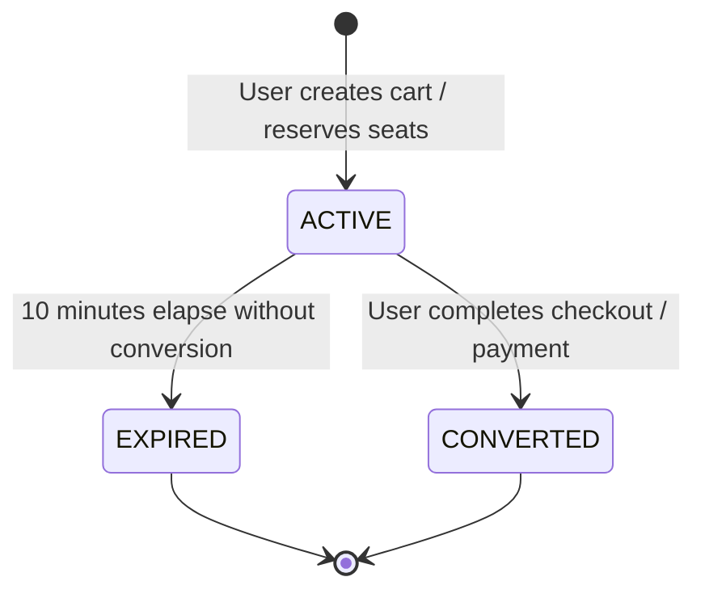

# Group 4: Reservations, Cart, Snacks & Purchases — Sequelize Model Inventory & Analysis

**Source Repository:** `https://github.com/manulzweb/riwi-cine-backend-1`  
**Reference Document:** `PLAN_MIGRACION_RIWI_CINE_NESTJS.md` / Migration Context  
**Date:** 2026-10-05  
**Target Environment:** NestJS + TypeORM + PostgreSQL  

---

## 1. Executive Summary

This inventory examines the Sequelize models for **Group 4 (Reservations, Cart, Snacks & Purchases)** from the legacy backend codebase. The models reviewed include:
- `Reservation` (`app/src/models/reservation.model.ts`)
- `ReservationSeat` (`app/src/models/reservation-seat.model.ts`)
- `Snack` (`app/src/models/snack.model.ts`)
- `Promotion` (`app/src/models/promotion.model.ts`)
- `Cart` (`app/src/models/cart.model.ts`)
- `CartItem` (`app/src/models/cart-item.model.ts`)
- `CartTicket` (`app/src/models/cart-ticket.model.ts`)
- `PurchaseHistory` (`app/src/models/purchase-history.model.ts`)
- Cross-model associations in `app/src/models/index.ts`
- Constants and Enums in `app/src/constant/reservation.constant.ts`, `cart.constant.ts`, and `snack.constant.ts`

### Key Highlights & Architectural Discrepancies:

1. **`PurchaseHistory` vs. New E-Commerce Architecture (`Order` & `OrderItem`):**
   - **Legacy Reality:** `PurchaseHistory` (`purchase_histories`) is NOT a detailed transactional ledger. It is a single row per user with simple accumulated counters (`total_purchases`, `total_spent`, `last_purchase_at`) initialized to zero at user registration. It contains no transaction IDs, itemized tickets, snacks, payments, or timestamps of individual orders.
   - **Plan Requirement:** The new NestJS plan proposes replacing or superseding `PurchaseHistory` with proper normalized e-commerce entities: `Order` and `OrderItem`. Historical summary metrics should either be computed on-the-fly via SQL aggregates (`COUNT(id)`, `SUM(total)`) or updated asynchronously via domain events into a read-model/cache.

2. **Concurrency & Seat Double-Booking Prevention (`reservation_seats`):**
   - **Plan Requirement:** A unique constraint/index on `(function_id, seat_id)` must exist to prevent two concurrent transactions from locking the same physical seat for the same movie function.
   - **Sequelize Reality:** In `reservation_seats`, `function_id` is completely **absent** from the table! The table only contains `id`, `reservation_id`, `seat_id`, `status`, and `price`. Furthermore, there is **no unique index** on `(reservation_id, seat_id)` either. Double-booking prevention in the legacy system was enforced strictly at the application layer through transactional joins (`reservations.function_id = :functionId`).
   - **Impact for TypeORM Migration:** To guarantee database-level concurrency protection, `function_id` should be denormalized into `reservation_seats`, and a partial unique index must be established:
     ```sql
     CREATE UNIQUE INDEX uq_reservation_seat_active ON reservation_seats (function_id, seat_id)
     WHERE status IN ('LOCKED', 'SOLD');
     ```

3. **Lazy Expiration Strategy (`expires_at`):**
   - Both `reservations` and `carts` implement a 10-minute temporary lock using `expires_at: DataTypes.DATE`.
   - Neither table has a dedicated database index on `expires_at` or `(status, expires_at)`.
   - In NestJS + TypeORM, a partial/composite index should be added to ensure fast query performance during lazy expiration checks and background scheduled cleanup jobs.

4. **Cart Architecture & Partial Unique Index:**
   - `carts` implements a partial unique index in Sequelize: `uniq_active_cart_per_user` on `user_id` `WHERE status = 'ACTIVE'`.
   - This ensures a user can have at most one active cart, while preserving historical carts (`CONVERTED`, `EXPIRED`).
   - In `index.ts`, `User.hasOne(Cart)` is defined, which is a domain mismatch with historical multi-cart data; in TypeORM this should be modeled as `@OneToMany(() => CartEntity, cart => cart.user)` with a dedicated query for the active cart.

5. **Naming Conventions & Field Mapping Inconsistencies:**
   - In `snack.model.ts`, `underscored: true` is **NOT** set, and columns `imageUrl` and `discountPercentage` do not define `field: 'image_url'` or `field: 'discount_percentage'`. In PostgreSQL, these column names are camelCase or lowercase without underscores, unlike the rest of the application which uniformly uses snake_case (`user_id`, `cart_id`, `function_id`).
   - In `reservation.model.ts` and `reservation-seat.model.ts`, `underscored: true` was not set, although individual FK fields specified `field: 'user_id'`, `field: 'reservation_id'`. As a result, audit columns default to `createdAt` and `updatedAt` unless overridden by global Sequelize options.

---

## 2. Models Matrix Summary

| Model | Table Name | PK | Timestamps | Underscored | Soft Delete (`paranoid`) | Belongs To | Has Many / Has One | Key Indexes / Constraints |
|---|---|---|---|---|---|---|---|---|
| `Reservation` | `reservations` | `id` (INTEGER, AI) | `true` | `false` (manual `field`) | `false` | `User` (`user_id`), `CinemaFunction` (`function_id`) | `ReservationSeat` (1:N, `as: 'reservationSeats'`), `CartTicket` (1:1, `as: 'cartTicket'`) | PK `reservations_pkey` |
| `ReservationSeat` | `reservation_seats` | `id` (INTEGER, AI) | `true` | `false` (manual `field`) | `false` | `Reservation` (`reservation_id`), `Seat` (`seat_id`) | None | PK `reservation_seats_pkey` (Missing `(function_id, seat_id)` unique constraint) |
| `Snack` | `snacks` | `id` (INTEGER, AI) | `true` | `false` | `false` | None | `CartItem` (1:N, `as: 'cartItems'`), `Promotion` (1:N, `as: 'promotions'`) | PK `snacks_pkey` |
| `Promotion` | `promotions` | `id` (INTEGER, AI) | `true` | `true` | `false` | `Snack` (`snack_id`, `as: 'snack'`) | None | PK `promotions_pkey` |
| `Cart` | `carts` | `id` (INTEGER, AI) | `true` | `true` | `false` | `User` (`user_id`, `as: 'user'`) | `CartItem` (1:N, `as: 'items'`), `CartTicket` (1:N, `as: 'tickets'`) | PK `carts_pkey`, Partial Unique Index `uniq_active_cart_per_user` (`user_id WHERE status = 'ACTIVE'`) |
| `CartItem` | `cart_items` | `id` (INTEGER, AI) | `true` | `true` | `false` | `Cart` (`cart_id`), `Snack` (`snack_id`) | None | PK `cart_items_pkey` |
| `CartTicket` | `cart_tickets` | `id` (INTEGER, AI) | `true` | `true` | `false` | `Cart` (`cart_id`), `CinemaFunction` (`function_id`), `Reservation` (`reservation_id`) | None | PK `cart_tickets_pkey` |
| `PurchaseHistory` | `purchase_histories` | `id` (INTEGER, AI) | `true` | `true` | `false` | `User` (`user_id`, `as: 'user'`) | None | PK `purchase_histories_pkey`, Unique `user_id` |

---

## 3. Detailed Model Inventories

### 3.1 Model: `Reservation`
- **File:** `app/src/models/reservation.model.ts`
- **Sequelize Model Name:** `Reservation`
- **Real Database Table Name (`tableName`):** `reservations`
- **Sequelize Options:**
  - `timestamps: true`
  - `underscored: false` (Relies on manual `field` definitions)
  - `paranoid: false` (No `deleted_at`)

#### Columns
| Field in DB | Property Name | Sequelize Type | SQL Type | PK | AutoInc | Nullable | Default | Unique | Notes |
|---|---|---|---|---|---|---|---|---|---|
| `id` | `id` | `DataTypes.INTEGER` | `INTEGER` | **Yes** | **Yes** | No | Sequence | **Yes** | Primary Key |
| `user_id` | `userId` | `DataTypes.INTEGER` | `INTEGER` | No | No | No | None | No | FK to `users(id)` |
| `function_id` | `functionId` | `DataTypes.INTEGER` | `INTEGER` | No | No | No | None | No | FK to `cinema_functions(id)` |
| `status` | `status` | `DataTypes.ENUM('ACTIVE', 'EXPIRED', 'RELEASED', 'CONFIRMED')` | `VARCHAR` / `ENUM` | No | No | No | `'ACTIVE'` | No | Reservation lifecycle status |
| `expires_at` | `expiresAt` | `DataTypes.DATE` | `TIMESTAMPTZ` | No | No | **Yes** | `null` | No | Expiration timestamp (default 10 min window) |
| `createdAt` / `created_at` | `createdAt` | `DataTypes.DATE` | `TIMESTAMPTZ` | No | No | No | `now()` | No | Audit creation timestamp |
| `updatedAt` / `updated_at` | `updatedAt` | `DataTypes.DATE` | `TIMESTAMPTZ` | No | No | No | `now()` | No | Audit update timestamp |

#### Foreign Keys and Constraints
- `user_id` REFERENCES `users(id)`
- `function_id` REFERENCES `cinema_functions(id)`

#### Indexes
- Primary Key index on `id`.
- Note: Missing composite index on `(user_id, status)` and `(expires_at)`.

#### Associations (from `app/src/models/index.ts` and model definition)
- `Reservation.belongsTo(User, { foreignKey: 'userId', as: 'user' })`
  - Inverse: `User.hasMany(Reservation, { foreignKey: 'userId', as: 'reservations' })`
- `Reservation.belongsTo(CinemaFunction, { foreignKey: 'functionId', as: 'function' })`
  - Inverse: `CinemaFunction.hasMany(Reservation, { foreignKey: 'functionId', as: 'reservations' })`
- `Reservation.hasMany(ReservationSeat, { foreignKey: 'reservationId', as: 'reservationSeats' })`
  - Inverse: `ReservationSeat.belongsTo(Reservation, { foreignKey: 'reservationId', as: 'reservation' })`
- `Reservation.hasOne(CartTicket, { foreignKey: 'reservation_id', as: 'cartTicket' })`
  - Inverse: `CartTicket.belongsTo(Reservation, { foreignKey: 'reservation_id', as: 'reservation' })`

#### Discrepancies vs Migration Plan:
1. **Lazy Expiration Index:** The plan specifies lazy expiration on reservation queries via `expires_at`. TypeORM should add an index `idx_reservations_status_expires (status, expires_at)` to accelerate filtering expired reservations.
2. **Naming in `index.ts`:** In `models/index.ts`, associations use `foreignKey: 'userId'` and `'functionId'` (camelCase) instead of `'user_id'` and `'function_id'`. In Sequelize this can generate redundant duplicate columns if not explicitly aligned. TypeORM must explicitly declare `@JoinColumn({ name: 'user_id' })` and `@JoinColumn({ name: 'function_id' })`.

---

### 3.2 Model: `ReservationSeat`
- **File:** `app/src/models/reservation-seat.model.ts`
- **Sequelize Model Name:** `ReservationSeat`
- **Real Database Table Name (`tableName`):** `reservation_seats`
- **Sequelize Options:**
  - `timestamps: true`
  - `underscored: false` (Uses manual `field` mappings)
  - `paranoid: false`

#### Columns
| Field in DB | Property Name | Sequelize Type | SQL Type | PK | AutoInc | Nullable | Default | Unique | Notes |
|---|---|---|---|---|---|---|---|---|---|
| `id` | `id` | `DataTypes.INTEGER` | `INTEGER` | **Yes** | **Yes** | No | Sequence | **Yes** | Primary Key |
| `reservation_id` | `reservationId` | `DataTypes.INTEGER` | `INTEGER` | No | No | No | None | No | FK to `reservations(id)` |
| `seat_id` | `seatId` | `DataTypes.INTEGER` | `INTEGER` | No | No | No | None | No | FK to `seats(id)` |
| `status` | `status` | `DataTypes.ENUM('LOCKED', 'RELEASED', 'SOLD')` | `VARCHAR` / `ENUM` | No | No | No | `'LOCKED'` | No | Seat lock status |
| `price` | `price` | `DataTypes.DECIMAL(10, 2)` | `NUMERIC(10,2)` | No | No | No | None | No | Snapshot price per seat |
| `createdAt` / `created_at` | `createdAt` | `DataTypes.DATE` | `TIMESTAMPTZ` | No | No | No | `now()` | No | Audit creation timestamp |
| `updatedAt` / `updated_at` | `updatedAt` | `DataTypes.DATE` | `TIMESTAMPTZ` | No | No | No | `now()` | No | Audit update timestamp |

#### Foreign Keys and Constraints
- Note: In `reservation-seat.model.ts`, the `references` block was omitted from column definitions and only configured in `index.ts`:
  - `reservation_id` REFERENCES `reservations(id)`
  - `seat_id` REFERENCES `seats(id)`

#### Indexes
- Primary Key index on `id`.
- **NO UNIQUE INDEX** currently exists on `(seat_id, reservation_id)` or `(function_id, seat_id)`.

#### Associations (from `app/src/models/index.ts`)
- `ReservationSeat.belongsTo(Reservation, { foreignKey: 'reservationId', as: 'reservation' })`
  - Inverse: `Reservation.hasMany(ReservationSeat, { foreignKey: 'reservationId', as: 'reservationSeats' })`
- `ReservationSeat.belongsTo(Seat, { foreignKey: 'seatId', as: 'seat' })`
  - Inverse: `Seat.hasMany(ReservationSeat, { foreignKey: 'seatId', as: 'reservationSeats' })`

#### Discrepancies vs Migration Plan:
1. **CRITICAL: Missing `function_id` and Unique Constraint on `(function_id, seat_id)`:**
   - **Plan Context:** Requires a unique constraint on `(function_id, seat_id)` to prevent concurrent double-booking of a seat.
   - **Sequelize Reality:** `function_id` is completely missing from `reservation_seats`. A seat can only be checked against a function by joining `reservations r ON r.id = rs.reservation_id WHERE r.function_id = :functionId`.
   - **Migration Recommendation:** Add `function_id INTEGER NOT NULL REFERENCES cinema_functions(id)` to `reservation_seats` via a TypeORM migration, populate it from `reservations.function_id`, and create a partial unique index:
     ```sql
     CREATE UNIQUE INDEX uq_reservation_seats_function_seat_active
     ON reservation_seats (function_id, seat_id)
     WHERE status IN ('LOCKED', 'SOLD');
     ```
2. **Status Enum Divergence:**
   - `ReservationSeat` defines ENUM `'LOCKED', 'RELEASED', 'SOLD'`.
   - `reservation.constant.ts` defines `SEAT_STATES = { AVAILABLE: 'AVAILABLE', OCCUPIED: 'OCCUPIED', LOCKED: 'LOCKED' }`.
   - TypeORM entity must harmonize these domain states (`LOCKED`, `RELEASED`, `SOLD`).

---

### 3.3 Model: `Snack`
- **File:** `app/src/models/snack.model.ts`
- **Sequelize Model Name:** `Snack`
- **Real Database Table Name (`tableName`):** `snacks`
- **Sequelize Options:**
  - `timestamps: true`
  - `underscored: false` (Neither `underscored: true` nor field mappings for camelCase properties!)
  - `paranoid: false`

#### Columns
| Field in DB | Property Name | Sequelize Type | SQL Type | PK | AutoInc | Nullable | Default | Unique | Notes |
|---|---|---|---|---|---|---|---|---|---|
| `id` | `id` | `DataTypes.INTEGER` | `INTEGER` | **Yes** | **Yes** | No | Sequence | **Yes** | Primary Key |
| `name` | `name` | `DataTypes.STRING(100)` | `VARCHAR(100)` | No | No | No | None | No | Confectionery product name |
| `description` | `description` | `DataTypes.TEXT` | `TEXT` | No | No | **Yes** | `null` | No | Product description |
| `price` | `price` | `DataTypes.DECIMAL(10, 2)` | `NUMERIC(10,2)` | No | No | No | None | No | Base price |
| `category` | `category` | `DataTypes.STRING(50)` | `VARCHAR(50)` | No | No | No | None | No | Category from `SNACK_CATEGORIES` |
| `stock` | `stock` | `DataTypes.INTEGER` | `INTEGER` | No | No | No | `0` | No | Available units (RN-049 inventory control) |
| `imageUrl`* | `imageUrl` | `DataTypes.STRING(255)` | `VARCHAR(255)` | No | No | **Yes** | `null` | No | Product image URL (*DB column naming anomaly) |
| `discountPercentage`* | `discountPercentage` | `DataTypes.DECIMAL(5, 2)` | `NUMERIC(5,2)` | No | No | No | `0` | No | Base percentage discount (*DB column naming anomaly) |
| `createdAt` / `created_at` | `createdAt` | `DataTypes.DATE` | `TIMESTAMPTZ` | No | No | No | `now()` | No | Audit creation timestamp |
| `updatedAt` / `updated_at` | `updatedAt` | `DataTypes.DATE` | `TIMESTAMPTZ` | No | No | No | `now()` | No | Audit update timestamp |

#### Foreign Keys and Constraints
- None defined in `Snack`.

#### Indexes
- Primary Key index on `id`.
- Note: No index on `category` (should be indexed for menu queries).

#### Associations (from `app/src/models/index.ts`)
- `Snack.hasMany(CartItem, { foreignKey: 'snack_id', as: 'cartItems' })`
  - Inverse: `CartItem.belongsTo(Snack, { foreignKey: 'snack_id', as: 'snack' })`
- `Snack.hasMany(Promotion, { foreignKey: 'snack_id', as: 'promotions' })`
  - Inverse: `Promotion.belongsTo(Snack, { foreignKey: 'snack_id', as: 'snack' })`

#### Discrepancies vs Migration Plan:
1. **Column Naming Anomaly (`imageUrl`, `discountPercentage`):**
   - Unlike all other tables, `snack.model.ts` omitted `underscored: true` and omitted `field: 'image_url'` and `field: 'discount_percentage'`.
   - In PostgreSQL, without quotes, unquoted identifiers become lowercase `imageurl` and `discountpercentage`, or `"imageUrl"` / `"discountPercentage"` if quoted by Sequelize.
   - TypeORM migration must check the existing database column name and standardize to `image_url` and `discount_percentage`.
2. **Inventory Check Constraint:** Business rule RN-049 requires `stock >= 0`. Adding a DB-level `CHECK (stock >= 0)` constraint is strongly recommended to protect against negative stock under high concurrency.
3. **Dual Discounting:** `Snack.discountPercentage` holds a permanent product discount, while `Promotion` holds temporary promotional windows. The order and business logic for combining these discounts must be explicit in NestJS domain services.

---

### 3.4 Model: `Promotion`
- **File:** `app/src/models/promotion.model.ts`
- **Sequelize Model Name:** `Promotion`
- **Real Database Table Name (`tableName`):** `promotions`
- **Sequelize Options:**
  - `timestamps: true`
  - `underscored: true`
  - `paranoid: false`

#### Columns
| Field in DB | Property Name | Sequelize Type | SQL Type | PK | AutoInc | Nullable | Default | Unique | Notes |
|---|---|---|---|---|---|---|---|---|---|
| `id` | `id` | `DataTypes.INTEGER` | `INTEGER` | **Yes** | **Yes** | No | Sequence | **Yes** | Primary Key |
| `snack_id` | `snackId` | `DataTypes.INTEGER` | `INTEGER` | No | No | No | None | No | FK to `snacks(id)` |
| `name` | `name` | `DataTypes.STRING(100)` | `VARCHAR(100)` | No | No | No | None | No | Promotion campaign name |
| `discount_type` | `discountType` | `DataTypes.ENUM('percent', 'fixed')` | `VARCHAR` / `ENUM` | No | No | No | None | No | Type of discount |
| `discount_value` | `discountValue` | `DataTypes.DECIMAL(10, 2)` | `NUMERIC(10,2)` | No | No | No | None | No | Value (percentage or fixed amount) |
| `start_date` | `startDate` | `DataTypes.DATE` | `TIMESTAMPTZ` | No | No | No | None | No | Validity start timestamp |
| `end_date` | `endDate` | `DataTypes.DATE` | `TIMESTAMPTZ` | No | No | No | None | No | Validity end timestamp |
| `is_active` | `isActive` | `DataTypes.BOOLEAN` | `BOOLEAN` | No | No | No | `true` | No | Manual activation toggle |
| `created_at` | `createdAt` | `DataTypes.DATE` | `TIMESTAMPTZ` | No | No | No | `now()` | No | Audit creation timestamp |
| `updated_at` | `updatedAt` | `DataTypes.DATE` | `TIMESTAMPTZ` | No | No | No | `now()` | No | Audit update timestamp |

#### Foreign Keys and Constraints
- `snack_id` REFERENCES `snacks(id)`

#### Indexes
- Primary Key index on `id`.
- Recommended: Composite index `idx_promotions_lookup (snack_id, is_active, start_date, end_date)`.

#### Associations (from `app/src/models/index.ts`)
- `Promotion.belongsTo(Snack, { foreignKey: 'snack_id', as: 'snack' })`
  - Inverse: `Snack.hasMany(Promotion, { foreignKey: 'snack_id', as: 'promotions' })`

#### Discrepancies vs Migration Plan:
1. **Scope of Promotions:** Currently restricted exclusively to confectionery (`snack_id`). There is no generic promotion entity for tickets or functions.
2. **Integrity Constraints:** Missing database-level constraints `CHECK (end_date >= start_date)` and `CHECK (discount_value > 0)`.

---

### 3.5 Model: `Cart`
- **File:** `app/src/models/cart.model.ts`
- **Sequelize Model Name:** `Cart`
- **Real Database Table Name (`tableName`):** `carts`
- **Sequelize Options:**
  - `timestamps: true`
  - `underscored: true`
  - `paranoid: false`
  - **Explicit Index:** Partial unique index on `user_id WHERE status = 'ACTIVE'`:
    ```ts
    indexes: [
      {
        unique: true,
        fields: ['user_id'],
        where: { status: 'ACTIVE' },
        name: 'uniq_active_cart_per_user',
      },
    ]
    ```

#### Columns
| Field in DB | Property Name | Sequelize Type | SQL Type | PK | AutoInc | Nullable | Default | Unique | Notes |
|---|---|---|---|---|---|---|---|---|---|
| `id` | `id` | `DataTypes.INTEGER` | `INTEGER` | **Yes** | **Yes** | No | Sequence | **Yes** | Primary Key |
| `user_id` | `userId` | `DataTypes.INTEGER` | `INTEGER` | No | No | No | None | No* | FK to `users(id)`. *Unique only when `status = 'ACTIVE'` |
| `status` | `status` | `DataTypes.ENUM('ACTIVE', 'EXPIRED', 'CONVERTED')` | `VARCHAR` / `ENUM` | No | No | No | `'ACTIVE'` | No | Cart lifecycle state |
| `expires_at` | `expiresAt` | `DataTypes.DATE` | `TIMESTAMPTZ` | No | No | **Yes** | `null` | No | Expiration timestamp (default 10 min window) |
| `giftcard_amount` | `giftcardAmount` | `DataTypes.DECIMAL(10, 2)` | `NUMERIC(10,2)` | No | No | No | `0` | No | Applied giftcard balance |
| `created_at` | `createdAt` | `DataTypes.DATE` | `TIMESTAMPTZ` | No | No | No | `now()` | No | Audit creation timestamp |
| `updated_at` | `updatedAt` | `DataTypes.DATE` | `TIMESTAMPTZ` | No | No | No | `now()` | No | Audit update timestamp |

#### Foreign Keys and Constraints
- `user_id` REFERENCES `users(id)`

#### Indexes
- Primary Key index on `id`.
- **Partial Unique Index:** `uniq_active_cart_per_user` on `user_id` WHERE `(status = 'ACTIVE')`.

#### Associations (from `app/src/models/index.ts`)
- `Cart.belongsTo(User, { foreignKey: 'user_id', as: 'user' })`
  - Inverse: `User.hasOne(Cart, { foreignKey: 'user_id', as: 'cart' })`
- `Cart.hasMany(CartItem, { foreignKey: 'cart_id', as: 'items' })`
  - Inverse: `CartItem.belongsTo(Cart, { foreignKey: 'cart_id', as: 'cart' })`
- `Cart.hasMany(CartTicket, { foreignKey: 'cart_id', as: 'tickets' })`
  - Inverse: `CartTicket.belongsTo(Cart, { foreignKey: 'cart_id', as: 'cart' })`

#### Discrepancies vs Migration Plan:
1. **Lazy Expiration:** Aligns with the plan requirement for lazy expiration via `expires_at`.
2. **Association Cardinality:** While the business rule enforces 1 active cart per user at any given moment, historically a user has many carts (`CONVERTED` or `EXPIRED`). In TypeORM, the relationship should be declared as `@ManyToOne(() => UserEntity)` in `Cart` and `@OneToMany(() => CartEntity)` in `User`.
3. **Index Definition in TypeORM:** The partial unique index must be explicitly preserved in TypeORM:
   ```ts
   @Index('uniq_active_cart_per_user', ['userId'], { unique: true, where: "status = 'ACTIVE'" })
   ```

---

### 3.6 Model: `CartItem`
- **File:** `app/src/models/cart-item.model.ts`
- **Sequelize Model Name:** `CartItem`
- **Real Database Table Name (`tableName`):** `cart_items`
- **Sequelize Options:**
  - `timestamps: true`
  - `underscored: true`
  - `paranoid: false`

#### Columns
| Field in DB | Property Name | Sequelize Type | SQL Type | PK | AutoInc | Nullable | Default | Unique | Notes |
|---|---|---|---|---|---|---|---|---|---|
| `id` | `id` | `DataTypes.INTEGER` | `INTEGER` | **Yes** | **Yes** | No | Sequence | **Yes** | Primary Key |
| `cart_id` | `cartId` | `DataTypes.INTEGER` | `INTEGER` | No | No | No | None | No | FK to `carts(id)` |
| `snack_id` | `snackId` | `DataTypes.INTEGER` | `INTEGER` | No | No | No | None | No | FK to `snacks(id)` |
| `quantity` | `quantity` | `DataTypes.INTEGER` | `INTEGER` | No | No | No | `1` | No | Quantity added (RN-012) |
| `unit_price` | `unitPrice` | `DataTypes.DECIMAL(10, 2)` | `NUMERIC(10,2)` | No | No | No | None | No | Frozen snapshot unit price |
| `created_at` | `createdAt` | `DataTypes.DATE` | `TIMESTAMPTZ` | No | No | No | `now()` | No | Audit creation timestamp |
| `updated_at` | `updatedAt` | `DataTypes.DATE` | `TIMESTAMPTZ` | No | No | No | `now()` | No | Audit update timestamp |

#### Foreign Keys and Constraints
- Configured in `index.ts`:
  - `cart_id` REFERENCES `carts(id)`
  - `snack_id` REFERENCES `snacks(id)`

#### Indexes
- Primary Key index on `id`.
- Recommended: Unique index on `(cart_id, snack_id)` so adding the same snack increments `quantity` rather than creating redundant lines.

#### Associations (from `app/src/models/index.ts`)
- `CartItem.belongsTo(Cart, { foreignKey: 'cart_id', as: 'cart' })`
  - Inverse: `Cart.hasMany(CartItem, { foreignKey: 'cart_id', as: 'items' })`
- `CartItem.belongsTo(Snack, { foreignKey: 'snack_id', as: 'snack' })`
  - Inverse: `Snack.hasMany(CartItem, { foreignKey: 'snack_id', as: 'cartItems' })`

#### Discrepancies vs Migration Plan:
1. **Quantity Constraints:** Application rule RN-012 forbids negative quantities. In the database, a `CHECK (quantity > 0)` constraint should be added.
2. **Transition to `OrderItem`:** When a Cart converts, its items will be copied into the new `order_items` table as permanent order lines.

---

### 3.7 Model: `CartTicket`
- **File:** `app/src/models/cart-ticket.model.ts`
- **Sequelize Model Name:** `CartTicket`
- **Real Database Table Name (`tableName`):** `cart_tickets`
- **Sequelize Options:**
  - `timestamps: true`
  - `underscored: true`
  - `paranoid: false`

#### Columns
| Field in DB | Property Name | Sequelize Type | SQL Type | PK | AutoInc | Nullable | Default | Unique | Notes |
|---|---|---|---|---|---|---|---|---|---|
| `id` | `id` | `DataTypes.INTEGER` | `INTEGER` | **Yes** | **Yes** | No | Sequence | **Yes** | Primary Key |
| `cart_id` | `cartId` | `DataTypes.INTEGER` | `INTEGER` | No | No | No | None | No | FK to `carts(id)` |
| `function_id` | `functionId` | `DataTypes.INTEGER` | `INTEGER` | No | No | No | None | No | FK to `cinema_functions(id)` |
| `reservation_id` | `reservationId` | `DataTypes.INTEGER` | `INTEGER` | No | No | No | None | No | FK to `reservations(id)` |
| `quantity` | `quantity` | `DataTypes.INTEGER` | `INTEGER` | No | No | No | `1` | No | Number of seats reserved |
| `unit_price` | `unitPrice` | `DataTypes.DECIMAL(10, 2)` | `NUMERIC(10,2)` | No | No | No | None | No | Snapshot base unit price |
| `discount_amount` | `discountAmount` | `DataTypes.DECIMAL(10, 2)` | `NUMERIC(10,2)` | No | No | No | `0` | No | Snapshot discount applied |
| `total` | `total` | `DataTypes.DECIMAL(10, 2)` | `NUMERIC(10,2)` | No | No | No | None | No | Net ticket line total |
| `created_at` | `createdAt` | `DataTypes.DATE` | `TIMESTAMPTZ` | No | No | No | `now()` | No | Audit creation timestamp |
| `updated_at` | `updatedAt` | `DataTypes.DATE` | `TIMESTAMPTZ` | No | No | No | `now()` | No | Audit update timestamp |

#### Foreign Keys and Constraints
- `cart_id` REFERENCES `carts(id)`
- `function_id` REFERENCES `cinema_functions(id)`
- `reservation_id` REFERENCES `reservations(id)`

#### Indexes
- Primary Key index on `id`.
- Recommended: Unique index on `reservation_id` (since a single reservation should only be attached to one active cart ticket).

#### Associations (from `app/src/models/index.ts`)
- `CartTicket.belongsTo(Cart, { foreignKey: 'cart_id', as: 'cart' })`
  - Inverse: `Cart.hasMany(CartTicket, { foreignKey: 'cart_id', as: 'tickets' })`
- `CartTicket.belongsTo(CinemaFunction, { foreignKey: 'function_id', as: 'function' })`
  - Inverse: `CinemaFunction.hasMany(CartTicket, { foreignKey: 'function_id', as: 'cartTickets' })`
- `CartTicket.belongsTo(Reservation, { foreignKey: 'reservation_id', as: 'reservation' })`
  - Inverse: `Reservation.hasOne(CartTicket, { foreignKey: 'reservation_id', as: 'cartTicket' })`

#### Discrepancies vs Migration Plan:
1. **Denormalization of `function_id`:** `CartTicket` references both `reservation_id` and `function_id`, even though `Reservation` also references `function_id`. This intentional denormalization accelerates function-level aggregations without requiring a join through `reservations`.
2. **Formula Integrity:** `total` should satisfy `total = (unit_price * quantity) - discount_amount`. A database check constraint `CHECK (total >= 0)` is recommended.

---

### 3.8 Model: `PurchaseHistory`
- **File:** `app/src/models/purchase-history.model.ts`
- **Sequelize Model Name:** `PurchaseHistory`
- **Real Database Table Name (`tableName`):** `purchase_histories`
- **Sequelize Options:**
  - `timestamps: true`
  - `underscored: true`
  - `paranoid: false`

#### Columns
| Field in DB | Property Name | Sequelize Type | SQL Type | PK | AutoInc | Nullable | Default | Unique | Notes |
|---|---|---|---|---|---|---|---|---|---|
| `id` | `id` | `DataTypes.INTEGER` | `INTEGER` | **Yes** | **Yes** | No | Sequence | **Yes** | Primary Key |
| `user_id` | `userId` | `DataTypes.INTEGER` | `INTEGER` | No | No | No | None | **Yes** | FK to `users(id)`, strictly unique (1:1 per user) |
| `total_purchases` | `totalPurchases` | `DataTypes.INTEGER` | `INTEGER` | No | No | No | `0` | No | Cumulative count of completed purchases |
| `total_spent` | `totalSpent` | `DataTypes.DECIMAL(12, 2)` | `NUMERIC(12,2)` | No | No | No | `0` | No | Cumulative amount spent |
| `last_purchase_at` | `lastPurchaseAt` | `DataTypes.DATE` | `TIMESTAMPTZ` | No | No | **Yes** | `null` | No | Timestamp of most recent purchase |
| `created_at` | `createdAt` | `DataTypes.DATE` | `TIMESTAMPTZ` | No | No | No | `now()` | No | Audit creation timestamp |
| `updated_at` | `updatedAt` | `DataTypes.DATE` | `TIMESTAMPTZ` | No | No | No | `now()` | No | Audit update timestamp |

#### Foreign Keys and Constraints
- PK on `id`.
- Unique constraint `purchase_histories_user_id_key` on `user_id`.
- `user_id` REFERENCES `users(id)`.

#### Indexes
- Primary Key index on `id`.
- Unique index on `user_id`.

#### Associations (from `app/src/models/index.ts`)
- `PurchaseHistory.belongsTo(User, { foreignKey: 'user_id', as: 'user' })`
  - Inverse: `User.hasOne(PurchaseHistory, { foreignKey: 'user_id', as: 'purchaseHistory' })`

#### Discrepancies vs Migration Plan:
1. **MAJOR ARCHITECTURAL REFACTORING: `Order` and `OrderItem` Replacement:**
   - **Legacy Limitation:** `PurchaseHistory` is merely a summary table. It cannot provide a user with receipts, tickets, transaction reference codes, payment gateway IDs, or purchased items.
   - **Migration Target:** As outlined in the migration plan, a full e-commerce transactional model (`Order` / `OrderItem`) must be implemented in NestJS.
   - **Data Strategy:**
     - For historical backward compatibility, `purchase_histories` can be maintained as a cached aggregate or read model.
     - Alternatively, when `orders` is deployed, `total_purchases` and `total_spent` can be calculated on-the-fly or materialized via PostgreSQL views.

---

## 4. Cross-Cutting Domain & Lifecycle Analysis

### 4.1 The Lazy Expiration Mechanism
In the legacy Sequelize codebase, both reservations and carts do not rely solely on asynchronous workers to expire stale holds; they utilize **lazy evaluation**:
1. When a user requests seat availability or attempts to add an item to a cart, the backend evaluates:
   ```sql
   WHERE status = 'ACTIVE' AND expires_at < NOW()
   ```
2. If `NOW() > expires_at`, the record is treated as expired and its status is transitioned to `EXPIRED` (and associated `reservation_seats` are transitioned to `RELEASED`).
3. **Database Indexing Need:** Without an index on `(status, expires_at)`, checking for expired reservations or filtering active reservations performs table scans under load. A composite index on `(status, expires_at)` is vital for high-traffic showtimes.

### 4.2 The Concurrency Hazard in Seat Locking
In a high-demand cinema ticketing scenario, concurrent requests attempt to reserve the same seat for the same function.
- In the legacy model, `reservation_seats` has no unique constraint on `(function_id, seat_id)` because `function_id` does not exist on that table.
- Relying exclusively on application-level checks without a database constraint allows race conditions where two simultaneous transactions pass the application validation and insert two active rows for the same seat.
- **The Solution:** Denormalize `function_id` into `reservation_seats` and enforce the partial unique index at the PostgreSQL level.

### 4.3 Cart State Machine

- A user can only possess **one** `ACTIVE` cart at a time (enforced by `uniq_active_cart_per_user`).
- When a cart becomes `EXPIRED`, the associated reservation seats are released.
- When converted, the cart items and tickets are transformed into immutable purchase records (`Order` and `OrderItem`).

---

## 5. Recommended Action Items for TypeORM Migration & NestJS Domain Design

1. **Denormalize `function_id` into `reservation_seats` and add Partial Unique Index:**
   ```sql
   ALTER TABLE reservation_seats ADD COLUMN function_id INTEGER REFERENCES cinema_functions(id);

   -- Backfill existing data from reservations
   UPDATE reservation_seats rs
   SET function_id = r.function_id
   FROM reservations r
   WHERE rs.reservation_id = r.id;

   ALTER TABLE reservation_seats ALTER COLUMN function_id SET NOT NULL;

   -- Prevent seat double-booking at the database level
   CREATE UNIQUE INDEX uq_reservation_seats_function_seat_active
   ON reservation_seats (function_id, seat_id)
   WHERE status IN ('LOCKED', 'SOLD');
   ```

2. **Add Lazy Expiration Composite Indexes:**
   ```sql
   CREATE INDEX idx_reservations_status_expires ON reservations (status, expires_at);
   CREATE INDEX idx_carts_status_expires ON carts (status, expires_at);
   ```

3. **Harmonize Column Naming in `snacks`:**
   - Verify whether PostgreSQL currently has `imageurl` / `discountpercentage` or camelCase columns.
   - Standardize to `image_url` and `discount_percentage` in TypeORM:
     ```sql
     ALTER TABLE snacks RENAME COLUMN "imageUrl" TO image_url;
     ALTER TABLE snacks RENAME COLUMN "discountPercentage" TO discount_percentage;
     ```

4. **Implement New `Order` and `OrderItem` Entities:**
   - Create `@Entity('orders')` with columns: `id`, `user_id`, `cart_id`, `status` (`PENDING`, `COMPLETED`, `FAILED`, `REFUNDED`), `subtotal`, `tax`, `discount_total`, `total`, `payment_method`, `transaction_id`, `paid_at`, `created_at`, `updated_at`.
   - Create `@Entity('order_items')` with columns: `id`, `order_id`, `item_type` (`TICKET`, `SNACK`), `reference_id` (`function_id` or `snack_id`), `seat_id` (nullable), `name`, `unit_price`, `quantity`, `total`.
   - Keep `purchase_histories` as an optional materialized aggregate or deprecate it in favor of direct queries on `orders`.

5. **TypeORM Partial Unique Index on `Cart`:**
   ```ts
   @Index('uniq_active_cart_per_user', ['userId'], { unique: true, where: "status = 'ACTIVE'" })
   @Entity('carts')
   export class CartEntity { ... }
   ```
